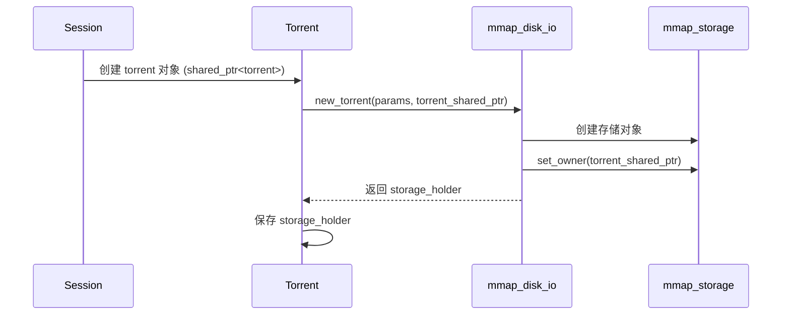

在 libtorrent 中，`mmap_disk_io`、`mmap_storage`、`torrent` 和 `file_storage` 这几个组件的关系是层级式的，各自负责不同的职责。下面详细解释它们的关系和交互方式：

---

## **1. 核心组件及其作用**
| 组件 | 作用 |
|------|------|
| **`mmap_disk_io`** | 全局磁盘 I/O 管理器，负责多个 torrent 的存储调度（读写、缓存、哈希校验等） |
| **`torrent`** | 代表一个具体的 BT 任务（种子），管理 peers、piece 下载顺序、状态等 |
| **`mmap_storage`** | 单个 torrent 的存储后端，负责文件读写、磁盘空间管理 |
| **`file_storage`** | 描述 torrent 的文件结构（文件名、大小、布局等），不涉及实际 I/O |

---

## **2. 为什么 `mmap_disk_io` 管理多个 `mmap_storage`？**
### **(1) 多任务并发管理**
- 一个 libtorrent 会话（`session`）可能同时下载多个 torrent。
- 每个 torrent 需要独立的存储对象（`mmap_storage`）管理其文件。
- `mmap_disk_io` 作为**全局磁盘 I/O 调度器**，集中管理所有 torrent 的存储对象。

### **(2) 资源共享**
- **`file_view_pool`（文件映射池）**：所有 `mmap_storage` 共享同一个文件打开/映射缓存，避免重复打开文件。
- **线程池**：`mmap_disk_io` 统一调度所有 torrent 的磁盘操作（如读、写、哈希），避免每个 torrent 独占线程。

### **(3) 统一优化**
- **I/O 合并**：将多个 torrent 的小块读写合并为顺序操作，提升磁盘吞吐量。
- **优先级调度**：根据 torrent 的优先级调整磁盘访问顺序。

---

## **3. 组件关系图**
```plaintext
+---------------------+
|     mmap_disk_io    |  (全局单例)
|---------------------|
| - m_torrents:       |  ▶ 存储所有 mmap_storage（按 storage_index_t 索引）
|   vector<mmap_storage> |
| - m_file_pool       |  ▶ 所有存储共享的文件映射池
+----------↑----------+
           |
           | 管理
           |
+----------↓----------+    +-------------------+
|       torrent       |    |    file_storage   |
|---------------------|    |-------------------|
| - storage_holder    |───▶| - 文件列表        |
| - download_priority |    | - 文件大小/偏移   |
+----------↑----------+    +-------------------+
           |
           | 持有
           |
+----------↓----------+
|    mmap_storage     |  (每个 torrent 一个实例)
|---------------------|
| - m_files           |───▶ 引用 torrent 的 file_storage
| - m_stat_cache      |     缓存文件状态（大小、修改时间）
| - m_file_priority   |     文件优先级设置
+---------------------+
```

---

## **4. 关键交互流程**
### **(1) 新增 Torrent**
1. `session` 创建一个新的 `torrent` 对象。
2. `torrent` 通过 `mmap_disk_io::new_torrent()` 申请存储：
   ```cpp
   storage_holder sh = disk_io.new_torrent(params, torrent_ptr);
   ```
3. `mmap_disk_io`：
   - 分配一个新的 `storage_index_t`（优先复用空闲槽位）。
   - 创建 `mmap_storage` 对象，并存入 `m_torrents`。
   - 返回 `storage_holder` 给 `torrent`。

### **(2) 文件读写**
1. `torrent` 需要读写数据时，调用 `mmap_storage::read()`/`write()`。
2. `mmap_storage`：
   - 通过 `file_storage` 查找文件路径和偏移。
   - 从 `m_file_pool` 获取文件映射（避免重复打开文件）。
   - 执行实际 I/O（可能委托给 `mmap_disk_io` 的线程池）。

### **(3) 移除 Torrent**
1. `torrent` 被销毁时，其 `storage_holder` 析构。
2. `mmap_disk_io`：
   - 回收 `storage_index_t` 到 `m_free_slots`。
   - 释放对应的 `mmap_storage` 对象。

---

## **5. 设计优势**
1. **解耦**：
   - `torrent` 只关心业务逻辑（如 peer 通信、piece 选择）。
   - `mmap_storage` 只关心文件存储。
   - `mmap_disk_io` 只关心调度和资源管理。

2. **性能优化**：
   - 共享 `file_view_pool` 减少文件打开开销。
   - 集中调度 I/O 请求，避免磁盘寻址抖动。

3. **扩展性**：
   - 可以替换 `mmap_storage` 为其他存储后端（如 SSD 优化版）。
   - 支持动态调整 torrent 优先级。

---

## **6. 总结**
- **`mmap_disk_io` 是中枢**：管理所有 torrent 的存储，协调 I/O 资源。
- **`mmap_storage` 是执行者**：每个 torrent 独占一个实例，处理具体文件操作。
- **`file_storage` 是元数据**：描述文件布局，被 `torrent` 和 `mmap_storage` 共享。

这种架构非常适合 BT 客户端的场景：**高并发、低延迟、资源高效复用**。

在 libtorrent 中，`storage_holder`、`mmap_disk_io` 和 `torrent` 之间的关联是通过 **间接索引管理** 和 **多级所有权机制** 实现的。下面详细解释它们的关联方式和移除逻辑：

---

### **1. 关联关系建立流程**

#### **(1) 创建 Torrent 时**
```cpp
// 在 mmap_disk_io 中创建存储对象
storage_holder mmap_disk_io::new_torrent(storage_params const& params, std::shared_ptr<void> const& torrent) {
    storage_index_t idx = m_free_slots.new_index(m_torrents.end_index());
    auto storage = std::make_shared<mmap_storage>(params, m_file_pool);
    
    // 关键关联步骤：
    storage->set_storage_index(idx);  // 存储对象知道自己的索引
    storage->set_owner(torrent);      // 存储对象持有 torrent 的 shared_ptr<void>
    
    m_torrents[idx] = storage;       // disk_io 通过索引管理存储对象
    return storage_holder(idx, *this); // 返回轻量级持有者
}
```

#### **(2) Torrent 持有 storage_holder**
```cpp
// torrent 类内部：
class torrent {
    storage_holder m_storage;
    // ...
public:
    void set_storage(storage_holder&& h) { 
        m_storage = std::move(h); 
    }
};
```

---

### **2. 移除 Torrent 时的解关联流程**

#### **(1) 用户触发移除**
```cpp
// session 移除 torrent 的调用链：
session::remove_torrent() → torrent::abort() → mmap_disk_io::remove_torrent()
```

#### **(2) mmap_disk_io::remove_torrent()**
```cpp
void mmap_disk_io::remove_torrent(storage_index_t st) {
    // 1. 从 m_torrents 中移除存储对象
    m_torrents.erase(st);  // 释放 mmap_storage
    
    // 2. 清理文件池中该存储的文件映射
    m_file_pool.release(st);
    
    // 3. 回收索引供后续复用
    m_free_slots.add(st); 
}
```

#### **(3) 关键点解释**
- **如何通过 `storage_index_t` 找到 torrent？**  
  实际上不需要直接查找 torrent！因为：
  - `mmap_storage` 析构时会自动释放其持有的 `shared_ptr<void>`（即 torrent 的引用）
  - 当最后一个引用（可能是磁盘操作持有的）释放时，torrent 对象自然析构

---

### **3. storage_holder 的作用**
#### **(1) 结构定义**
```cpp
class storage_holder {
    storage_index_t m_idx;
    mmap_disk_io& m_disk_io; // 反向引用 disk_io
public:
    ~storage_holder() {
        if (m_idx != invalid_index) 
            m_disk_io.remove_torrent(m_idx); // 析构时触发移除
    }
};
```

#### **(2) 所有权转移**
```mermaid
graph TD
    A[torrent] -- holds --> B[storage_holder]
    B -- contains --> C[storage_index_t]
    C -- indexes --> D[mmap_disk_io::m_torrents]
    D -- stores --> E[mmap_storage]
    E -- holds --> F[shared_ptr<void> (torrent)]
```

---

### **4. 为什么不需要显式关联 torrent？**
1. **间接生命周期管理**：
   - `mmap_storage` 通过 `shared_ptr<void>` 持有 torrent
   - 只要存储对象或磁盘操作存在，torrent 就不会析构

2. **索引驱动设计**：
   - 所有操作通过 `storage_index_t` 定位资源
   - 不需要维护复杂的反向映射

3. **自动触发移除**：
   - 当最后一个 `storage_holder` 析构时（通常是 torrent 对象析构时）
   - 自动调用 `mmap_disk_io::remove_torrent()`

---

### **5. 线程安全保证**
| 操作 | 线程安全措施 |
|------|-------------|
| **存储访问** | 通过 storage_index_t + 互斥锁保护 m_torrents |
| **torrent 析构** | 由 shared_ptr 的原子引用计数保证 |
| **文件池清理** | 先移除条目后异步关闭文件（如之前讨论） |

---

### **6. 典型生命周期示例**
```cpp
// 场景：用户移除正在做种的 torrent
1. session.remove() 标记 torrent 为待删除
2. torrent 取消所有 peer 连接
3. torrent 析构时，其成员 m_storage（storage_holder）析构
4. storage_holder 析构调用 mmap_disk_io::remove_torrent(storage_index)
5. mmap_disk_io 清理存储和文件池
6. 最后一个 mmap_storage 的 shared_ptr<void> 释放 → torrent 对象析构
```

---

### **7. 设计优势总结**
1. **解耦**：`storage_holder` 无需知道 torrent 的具体类型
2. **安全**：依赖 RAII 自动触发资源释放
3. **高效**：索引查找比指针/映射表更缓存友好
4. **可扩展**：支持 torrent 对象替换（如热升级时）

这种设计体现了 libtorrent 的核心哲学：**通过精细的资源所有权划分，实现高性能与线程安全的平衡**。

您的问题非常准确！我需要澄清一个重要误解：`new_torrent()` 方法确实**不会创建 torrent 对象**，而是为**已存在的 torrent 创建关联的存储后端**。让我们重新梳理完整的对象创建和关联流程：

---

### **1. 完整对象创建时序**


---

### **2. 关键点澄清**
#### **(1) `new_torrent` 的参数 `torrent`**
```cpp
std::shared_ptr<void> const& torrent
```
- **传入对象**：这是**已经创建的 torrent 对象的共享指针**（由调用方创建）
- **类型擦除**：使用 `void` 避免磁盘 I/O 层依赖 torrent 具体类型

#### **(2) 为什么需要传递 torrent 的 shared_ptr？**
- **生命周期管理**：确保存储操作进行时，torrent 的元数据（如 `file_storage`）不会被释放
- **线程安全**：磁盘线程可能访问 torrent 的文件布局信息

#### **(3) `storage_holder` 的作用**
```cpp
class storage_holder {
    storage_index_t m_idx;  // 存储索引
    mmap_disk_io& m_disk_io; // 反向引用
    // 析构时调用 m_disk_io.remove_torrent(m_idx)
};
```
- **轻量级包装**：仅包含索引和反向引用，不直接持有 torrent
- **RAII 控制**：通过析构自动触发存储清理

---

### **3. 典型调用栈示例**
```cpp
// 1. session 创建 torrent
auto t = std::make_shared<torrent>(params);

// 2. torrent 构造函数内部调用：
void torrent::init() {
    // 准备存储参数
    storage_params sp = ...;
    
    // 调用 disk_io 创建存储（传入自身的 shared_ptr）
    m_storage = m_ses.disk_io().new_torrent(sp, shared_from_this());
}
```

---

### **4. 对象关系图**
```plaintext
+---------------------+
|      session        |
|---------------------|
| - std::vector<      |
|   shared_ptr<torrent>> |
+----------↑----------+
           |
           | 持有
           |
+----------↓----------+    +-------------------+
|       torrent       |    |    file_storage   |
|---------------------|    |-------------------|
| - storage_holder    |───▶| - 文件列表        |
| - shared_ptr<...>   |    | - 文件大小/偏移   |
+----------↑----------+    +-------------------+
           |                     ↑
           | 传入               | 引用
           |                    |
+----------↓-------------------↓----------+
|          mmap_disk_io                   |
|-----------------------------------------|
| - aux::vector<mmap_storage> m_torrents  |
| - storage_free_list m_free_slots        |
+----------↑------------------------------+
           |
           | 通过 storage_index_t 索引
           |
+----------↓----------+
|    mmap_storage     |
|---------------------|
| - shared_ptr<void>  |───▶ 实际持有 torrent
| - storage_index_t   |
+---------------------+
```

---

### **5. 为什么设计如此复杂？**
1. **解耦**：磁盘 I/O 子系统不需要知道 torrent 的具体实现
2. **线程安全**：
   - Torrent 可在主线程移除
   - 磁盘线程通过 `shared_ptr<void>` 保证操作期间对象存活
3. **资源管理**：
   - `storage_holder` 的 RAII 特性确保无泄漏
   - 索引机制提高缓存局部性

---

### **6. 常见误区澄清**
| 误解 | 实际情况 |
|------|----------|
| "`new_torrent` 创建 torrent" | 只创建存储后端，torrent 已存在 |
| "`storage_holder` 持有 torrent" | 仅通过索引间接关联，实际由 `mmap_storage` 持有 |
| "需要显式查找 torrent" | 通过 `shared_ptr<void>` 自动管理生命周期 |

这种设计完美体现了单一职责原则：
- **torrent**：处理 peer 通信、piece 选择
- **mmap_storage**：处理文件 I/O
- **mmap_disk_io**：全局资源调度

在 libtorrent 中，**文件映射（File Mapping）** 是指通过内存映射（Memory-mapped Files）技术将磁盘文件直接映射到进程的虚拟内存空间。这种机制允许程序像访问内存一样访问文件数据，而无需传统的 `read/write` 系统调用。以下是详细解释：

---

### **1. 文件映射的核心概念**
| 术语 | 说明 |
|------|------|
| **内存映射文件** | 通过 `mmap()`（Unix/Linux）或 `CreateFileMapping()`（Windows）将文件映射到虚拟内存 |
| **`file_mapping`** | libtorrent 中封装系统级内存映射的对象 |
| **`file_view_pool`** | 管理所有活跃文件映射的缓存池 |

---

### **2. 为什么需要文件映射？**
#### **(1) 性能优势**
- **零拷贝访问**：直接通过指针操作文件数据，避免内核态-用户态数据拷贝
- **操作系统缓存**：由内核自动处理页面缓存，优先使用空闲内存
- **预读优化**：系统可预测性预加载文件块

#### **(2) 特别适合 BT 场景**
```cpp
// 典型 BT 文件访问模式：
void read_piece(piece_index_t piece) {
    // 计算文件偏移量
    auto [file_idx, offset] = storage->map_piece_to_file(piece);
    
    // 获取文件映射视图
    file_mapping* mapping = file_pool.get(file_idx);
    
    // 直接访问内存（无需显式read）
    char* data = mapping->view() + offset;
    process_data(data);
}
```

---

### **3. `file_view_pool::release()` 的作用**
#### **(1) 功能**
- 释放指定 `storage_index_t` 关联的所有内存映射
- **实际行为**：
  - 从缓存池移除映射条目
  - **延迟**执行实际的文件关闭和内存取消映射（避免阻塞）

#### **(2) 触发时机**
- Torrent 被移除时
- 存储对象关闭时

#### **(3) 代码关键点
```cpp
void file_view_pool::release(storage_index_t st) {
    std::vector<std::shared_ptr<file_mapping>> defer_destruction;
    
    {
        std::lock_guard l(m_mutex);
        // 查找该存储的所有映射
        auto [begin, end] = find_mappings(st);
        
        // 转移所有权到临时容器
        for (auto it = begin; it != end; ++it) {
            defer_destruction.emplace_back(std::move(it->mapping));
        }
        
        m_files.erase(begin, end); // 从池中移除
    }
    
    // 临时容器析构 → 实际执行 munmap()/CloseHandle()
}
```

---

### **4. 文件映射的生命周期**
```mermaid
graph LR
    A[Torrent添加文件] --> B[创建file_mapping]
    B --> C[插入file_view_pool]
    C --> D[多线程读取/写入]
    D --> E[Torrent移除]
    E --> F[release()触发延迟销毁]
```

---

### **5. 系统级实现差异**
| 平台 | API | 特性 |
|------|-----|------|
| **Linux/Unix** | `mmap()`/`munmap()` | 支持匿名映射、共享映射 |
| **Windows** | `CreateFileMapping()`/`MapViewOfFile()` | 需要显式刷新写入（FlushViewOfFile） |
| **MacOS** | `mmap()` | 类似Linux，但有独特的缓存策略 |

---

### **6. 性能注意事项**
1. **映射粒度**：
   - libtorrent 通常按文件粒度映射（而非整个 torrent）
   - 大文件可能分区域映射

2. **写操作处理**：
   ```cpp
   // 写入时需要同步：
   mapping->flush(offset, size);
   ```

3. **缓存策略**：
   - 活跃文件保持在池中（LRU 策略）
   - 通过 `m_file_pool.resize()` 限制总映射数

---

### **7. 典型问题排查**
- **问题**：内存增长过快  
  **原因**：未及时调用 `release()`，导致映射累积  
  **解决**：检查 torrent 移除逻辑

- **问题**：写入后文件损坏  
  **原因**：未调用 `flush()`  
  **解决**：确保写操作后同步

---

### **总结**
- **文件映射**是 libtorrent 高性能存储的核心机制
- **`file_view_pool`** 作为全局缓存管理器：
  - 避免重复打开同一文件
  - 实现跨 torrent 的资源共享
- **延迟释放设计**确保线程安全与性能平衡

这种设计使得 libtorrent 能够高效处理大量并发文件 I/O 操作，特别是在做种/下载数百个 torrent 时仍保持低内存开销。