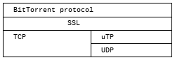

# Manual Reference

## Overview

libtorrent 的接口由几个类组成。主要的类是 [session](https://www.libtorrent.org/reference-Session.html#session) ，它包含了为所有 torrent 提供服务的主循环。

基本用法如下：

- 构建一个 `session` ，可以选择传入之前 `session` 的状态。使用 [read_session_params()](https://www.libtorrent.org/reference-Session.html#read_session_params()) 解码，
并将得到的 [session_params](https://www.libtorrent.org/reference-Session.html#session_params) 对象传递给 `session` 构造函数。

- 启动扩展（参见 [add_extension()](https://www.libtorrent.org/reference-Torrent_Handle.html#add_extension())）。

- 启动 `DHT`、`LSD`、`UPnP`、`NAT-PMP` 等功能（参见 `start_dht()`、`start_lsd()`、`start_upnp()` 和 `start_natpmp()`）。

- 解析 `.torrent` 文件并将其添加到 `session 中`（参见 [torrent_info](https://www.libtorrent.org/reference-Torrent_Info.html#torrent_info)、
[async_add_torrent()](https://www.libtorrent.org/reference-Session.html#async_add_torrent()) 和 
[add_torrent()](https://www.libtorrent.org/reference-Session.html#add_torrent())）。

- 运行主循环（参见 [session](https://www.libtorrent.org/reference-Session.html#session) ）。
    - 轮询 alerts 消息（参见 [wait_for_alert()](https://www.libtorrent.org/reference-Session.html#wait_for_alert()) 和 [pop_alerts()](https://www.libtorrent.org/reference-Session.html#pop_alerts())）。
    - 更新 torrent 的状态（参见 [state_update_alert](https://www.libtorrent.org/reference-Alerts.html#state_update_alert)）。
    - 处理其他 alerts 消息（参见 [alert](https://www.libtorrent.org/reference-Alerts.html#alert)）。
    - 查询 [session](https://www.libtorrent.org/reference-Session.html#session) 信息（参见 `session::status()`）。
    - 添加或移除 [session](https://www.libtorrent.org/reference-Session.html#session) 中的 torrent（参见 [remove_torrent()](https://www.libtorrent.org/reference-Custom_Storage.html#remove_torrent())）。

- 为所有 torrent_handle 保存恢复数据（可选，参见 [save_resume_data()](https://www.libtorrent.org/reference-Torrent_Handle.html#save_resume_data())）。

- 保存 `session` 状态（参见 [session_state()](https://www.libtorrent.org/reference-Session.html#session_state()) 和 [write_session_params()](https://www.libtorrent.org/reference-Session.html#write_session_params())）。

- 销毁 `session` 对象。

本手册详细描述了每个类和函数，您也可以查看 [tutorial](https://www.libtorrent.org/tutorial-ref.html) 以获取更多信息。

关于如何创建 torrent 文件的说明，请参阅 [create_torrent](https://www.libtorrent.org/reference-Create_Torrents.html#create_torrent)。

## forward declarations（前置声明）

不建议对 libtorrent 命名空间中的类型进行前置声明，因为这可能会在未来的版本中导致问题。相反，应该包含 `libtorrent/fwd.hpp` 以获取 libtorrent 中所有公共类型的前置声明。

## trouble shooting（问题排除）

开发人员面临的一个常见问题是 torrents 会无故停止。以下描述了 libtorrent 在哪些条件下会停止你的 torrents、如何发现这一问题以及如何解决。

请务必跟踪 torrents 的暂停状态、错误状态和上传模式。默认情况下，torrents 是自动管理的，这意味着 libtorrent 会自动暂停、恢复、清理它们，并将它们从上传模式中移除。

每当一个 torrent 遇到致命错误时，它将被停止，`torrent_status::error` 会描述导致停止的错误。如果 torrent 是自动管理的，它会定期被清理，
并根据每个 seed (种子, 指拥有完整文件的上传者‌‌) 对应的下载者数量来决定暂停或恢复。这将有效地为最需要种子的 torrent 提供种子。

如果一个 torrent 遇到磁盘写入错误，它将被设置为上传模式。这意味着它将不会下载任何内容，而只会进行上传。
假设写入错误是由磁盘已满或写入权限错误引起的：
如果 torrent 文件是自动管理的，它会定期退出上传模式，尝试再次将数据写入磁盘，（如果成功）这意味着如果问题得到解决，torrent 文件可以从某些磁盘错误中恢复；
如果 torrent 文件不是自动管理的，你需要调用 `set_upload_mode()` 来重新开启下载。

有关如何排查性能问题的更详细指南，请参阅 [故障排除](https://www.libtorrent.org/troubleshooting.html) 部分。

## ABI considerations（ABI 注意事项）

libtorrent 在主要版本（major）和次要版本（minor）相同的情况下会保持稳定的 ABI（应用程序二进制接口）。

例如，libtorrent-1.2.0 与 libtorrent-1.2.1 是 ABI 兼容的，但与 libtorrent-1.1 不兼容。

## network primitives（网络原语，网络基本操作）

在 libtorrent 命名空间中，有一些 typedef（类型别名）从 boost::asio 命名空间中引入了网络类型。这些类型别名包括：

```cpp
using address = boost::asio::ip::address;
using address_v4 = boost::asio::ip::address_v4;
using address_v6 = boost::asio::ip::address_v6;
using boost::asio::ip::tcp;
using boost::asio::ip::udp;
```

它们是在 `<libtorrent/socket.hpp>` 头文件里定义的。

`using` 语句将提供对以下内容的便捷访问：

```cpp
tcp::endpoint
udp::endpoint
```

这些是 libtorrent 中使用的端点类型。端点（endpoint） 是一个带有关联端口号的地址。

关于这些类型的文档，请参考 [asio 文档](https://www.boost.org/doc/libs/1_66_0/doc/html/boost_asio.html)。

## exceptions (异常)

在 libtorrent 中，许多函数都有两个版本：

- 一个版本在出错时抛出异常。

- 另一个版本接受一个 `error_code` 引用，并在出错时填充错误代码。

对于抛出异常的情况，libtorrent 会抛出 `boost::system::system_error` 异常，该异常携带一个描述底层错误的 `error_code`。


### translating error codes (翻译错误代码)

对于系统错误（即属于通用类别或系统类别的错误），`error_code::message()` 函数通常会返回本地化的错误字符串。

然而，属于 libtorrent 错误类别的错误不会本地化，它们仅提供英文描述。为了翻译 libtorrent 错误，
可以将 `error_code` 对象的错误类别与 `lt::libtorrent_category()` 进行比较，如果匹配，则说明错误代码属于上述列表中的错误。
你可以提供自己的从错误代码到字符串的映射，并实现本地化。在这种情况下，你不能依赖 `error_code::message()` 来生成字符串。

错误代码的数值是 API 的一部分，并且会保持不变，尽管可能会在末尾添加新的错误代码。

以下是一个如何翻译错误代码的简单示例：

```cpp
std::string error_code_to_string(boost::system::error_code const& ec)
{
    if (ec.category() != lt::libtorrent_category())
    {
        return ec.message();
    }
    // the error is a libtorrent error

    int code = ec.value();
    static const char const* swedish[] =
    {
        "inget fel",
        "en fil i torrenten kolliderar med en fil fran en annan torrent",
        "hash check misslyckades",
        "torrentfilen ar inte en dictionary",
        "'info'-nyckeln saknas eller ar korrupt i torrentfilen",
        "'info'-faltet ar inte en dictionary",
        "'piece length' faltet saknas eller ar korrupt i torrentfilen",
        "torrentfilen saknar namnfaltet",
        "ogiltigt namn i torrentfilen (kan vara en attack)",
        // ... more strings here
    };

    // use the default error string in case we don't have it
    // in our translated list
    if (code < 0 || code >= sizeof(swedish)/sizeof(swedish[0]))
        return ec.message();

    return swedish[code];
}
```

## magnet links (磁力链)

磁力链接是包含 `info-hash`、显示名称以及可选的 `tracker url` 的 `URI`。`magnet link` 的理念是，终端用户可以在浏览器中点击链接，
然后由 bittorrent 应用程序进行下载，而无需任何.torrent文件。

`magnet URI` 的格式如下：

```
magnet:?xt=urn:btih: Base16 encoded info-hash [ &dn= name of download ] [ &tr= tracker URL ]*
```

为了通过 `magnet link` 仅下载 `.torrent` 文件中的 `metadata`（元数据），在添加之前，
应在 [add_torrent_params](https://www.libtorrent.org/reference-Add_Torrent.html#add_torrent_params) 中设置 `torrent_flags::upload_mode` 标志。

在这种情况下，当从 `swarm`（下载群）中接收到元数据时，`torrent` 任务仍将继续运行，
但它会断开与大多数 `peer`s（对等节点）的连接（因为与已经拥有 `metadata` 的 `peers` 保持连接是多余的）。它将仅保留对 `metadata` 的 seeding（播种）。

需要注意的是，如果 `torrent` 中包含文件，那就将会导致空文件的创建。
若需避免此情况，可以将 `file_priority` 设置为一系列 0（因为文件数量事先未知），或者将 `save_path` 设置为一个无效路径。

### .torrent file

要从通过 `magnet link`（或以任何方式）添加的 `torrent` 中保存一个 `.torrent` 文件，请按照以下步骤操作：

- 在 [torrent_handle](https://www.libtorrent.org/reference-Torrent_Handle.html#save_resume_data()) 上调用 [save_resume_data()](https://www.libtorrent.org/reference-Torrent_Handle.html#torrent_handle) ，并确保传入 `save_info_dict` 标志。
- 等待 `resume_data_alert` 。
- 调用 [write_torrent_file()](https://www.libtorrent.org/reference-Resume_Data.html#write_torrent_file()) ，并传入从 [alert](https://www.libtorrent.org/reference-Alerts.html#alert) 中获取的 [add_torrent_params](https://www.libtorrent.org/reference-Add_Torrent.html#add_torrent_params
续传数据格式与.torrent文件格式非常相似，当在续传数据中包含信息字典（info-dict）时，续传文件可以作为一个.torrent文件使用（仅有一些细微的例外）。) 对象。

续传数据格式(`resume data format`)与 `.torrent` 文件格式非常相似，当在续传数据中包含 `info-dict` 时，续传文件可以作为一个 `.torrent` 文件使用（仅有一些细微的例外）。

## BitTorrent v2 torrents (BitTorrent v2 种子)

BitTorrent v2 引入了许多新特性，这些特性在此 [博客文章](https://blog.libtorrent.org/2020/09/bittorrent-v2/) 
以及 [BEP 52](https://www.bittorrent.org/beps/bep_0052.html) 中有所概述。
v2 协议引入了使用 `merkle hash tree`（默克尔哈希树）替代扁平的 `piece hashes list` (分片哈希列表)的可能性。
它还支持 `hybrid torrents`（混合种子），这些 `torrents` 既是有效的经典种子（v1），也是有效的 v2 种子。
混合种子同时包含扁平的 `piece hashes list` 和 `merkle hash tree`。

这引入了一些新的错误情况。混合种子的 v1 和 v2 哈希可能会不匹配。由于 v2 种子使用 `SHA-256` 而 v1 使用 `SHA-1`，而哈希不匹配的问题只有在分片下载完成后才能被检测到。
这将导致 `torrent_inconsistent_hashes` 错误。

磁力链可能仅包含 v1 的 `info-hash` 或 v2 的 `info-hash`。如果两个独立的磁力链，一个是仅 v1 的，另一个是仅 v2 的，最终解析为同一个混合种子时，
这两种 [torrent_handle](https://www.libtorrent.org/reference-Torrent_Handle.html#torrent_handle) 对象都会将被置于 `duplicate_torrent` 错误状态。
在这种状态下，必须移除其中一个，另一个可以恢复，以便重新下载 `metadata` 。

当两个 `torrent` 发生冲突时，会发布 [torrent_conflict_alert](https://www.libtorrent.org/reference-Alerts.html#torrent_conflict_alert)。
该 alert 继承自 [torrent_alert](https://www.libtorrent.org/reference-Alerts.html#torrent_alert)，因此与一个 `torrent_handle` 相关联。
它包含第二个 `torrent_handle`，指向冲突中的另一个种子，以及已下载的元数据。
解决冲突的一种方法是移除这两个种子，并使用 `torrent_conflict_alert` 中提供的 `metadata` 重新添加。

当 v1-only 或 v2-only 的磁力链解析后发现其实是 `hybird torrent` 时，与该种子关联的 [info_hash_t](https://www.libtorrent.org/reference-Core.html#info_hash_t) 对象将被更新，以同时包含 v1 和 v2 的信息哈希。
这适用于 [torrent_handle::info_hashes()](https://www.libtorrent.org/reference-Torrent_Handle.html#info_hashes()) 和 [torrent_info::info_hashes()](https://www.libtorrent.org/reference-Torrent_Info.html#info_hashes()) 。

> *译注：*
> 举个例子，你有一个 v1-only 磁力链，只包含 v1 的 info-hash（SHA-1）。
当你开始下载时，发现这个 v1 torrent 实际上是一个 hybird torrent（既支持 v1 也支持 v2）。
客户端会更新这个原 v1 torrent 的 info_hash_t 对象，使其同时包含 v1 和 v2 的 info-hash。
同样的情况也适用于 v2-only 磁力链。

## queuing（队列管理）

libtorrent 支持队列管理。队列管理是一种基于特定条件自动暂停和恢复种子的机制。这些条件取决于种子的整体状态（检查中、下载中或做种中）。

要选择退出队列管理逻辑，请确保在添加种子时，`add_torrent_params::flags` 中清除了 `torrent_flags::auto_managed` 标志位。
或者在种子句柄上调用 [torrent_handle::unset_flags()](https://www.libtorrent.org/reference-Torrent_Handle.html#unset_flags()) 并传入 `torrent_flags::auto_managed`。

队列管理逻辑的总体目的是在任意 `torrent` 下载和上传负载下提高性能。
例如，如果你想在有限的家用网络连接上下载 100 个 `torrent`，通过一次下载一个（或可能两个）而不是同时下载所有 `torrent`，可以提高性能。
其好处包括：

- `torrent` 平均完成时间：比同时下载所有 `torrent` 的情况减少一半。
- 上传容量利用率：更有可能达到对等节点（peers）的互惠速率，并可能提高你的投资回报率（下载与上传的比例）。
- 磁盘 I/O 负载：更可能集中在局部，这可能会提高 I/O 性能并减少碎片化。

从根本上说，队列管理分为三个独立的队列：

- checking torrents (检查中的种子队列)
- downloading torrents (下载中的种子队列)
- seeding torrents (做种中的种子队列)

每个未处于做种状态的 `torrent` 都有一个与之关联的队列编号，这表示它在启动队列中的位置。请参阅 [torrent_status::queue_position](https://www.libtorrent.org/reference-Torrent_Status.html#queue_position)。

除了每个队列的限制外，还有一个总体的限制，设置在 [settings_pack::active_limit](https://www.libtorrent.org/reference-Settings.html#active_limit) 中。
自动管理器永远不会启动超过此数量的 `torrent`（除了下面描述的一个例外情况）。非自动管理的 `torrent` 不受此逻辑的限制，也不会被计入。

在固定的时间间隔内，系统会检查是否需要重新排序哪些 `torrent` 处于活动状态，哪些 `torrent` 处于队列中。
此间隔可以通过 [settings_pack::auto_manage_interval](https://www.libtorrent.org/reference-Settings.html#auto_manage_interval) 进行控制。

为了使队列管理正常工作，需要保存并恢复所有 `torrent` 的续传数据。请参阅 [torrent_handle::save_resume_data()](https://www.libtorrent.org/reference-Torrent_Handle.html#save_resume_data())。

### queue position (队列位置)

队列前端的 `torrent` 会被启动，其余的 `torrent` 则按其队列位置排序。任何新添加的 `torrent` 都会被放置在队列的末尾。
一旦某个 `torrent` 被移除或转变为做种状态，其队列位置将变为 -1，而所有原本位于它之后的 `torrent` 会依次向前移动，以填补空缺。

队列位置始终是连续的，形成一个没有空缺的序列。

较低的队列位置意味着更接近队列的前端，这些 `torrent` 会比队列位置较高的 `torrent` 更早启动。

要查询某个 `torrent` 在队列中的位置或更改其位置，请参阅以下函数：

[torrent_handle::queue_position()](https://www.libtorrent.org/reference-Torrent_Handle.html#queue_position()), 
[torrent_handle::queue_position_up()](https://www.libtorrent.org/reference-Torrent_Handle.html#queue_position_up()),
[torrent_handle::queue_position_down()](https://www.libtorrent.org/reference-Torrent_Handle.html#queue_position_down()), 
[torrent_handle::queue_position_top()](https://www.libtorrent.org/reference-Torrent_Handle.html#queue_position_top()),
[torrent_handle::queue_position_bottom()](https://www.libtorrent.org/reference-Torrent_Handle.html#queue_position_bottom()).

### checking queue (检查队列)

检查队列会影响处于 `torrent_status::checking`（检查中）或 `torrent_status::allocating`（分配中）状态且为自动管理的 `torrent`。

检查队列会确保在其队列中的 `torrent` 在任何给定时间内，启动的 `torrent` 数量不超过 `settings_pack::active_checking_limit` 设置的限制。
一旦某个 `torrent` 完成检查并转移到其他状态，队列中的下一个 `torrent` 将开始检查。

任何通过 `force-started`（强制启动）或 `force-stopped`（强制停止）添加的 `torrent`（即未设置自动管理标志），将不受此限制的影响，它们会独立且并行地进行检查。

一旦 `torrent` 完成文件检查或恢复数据检查，它将被放入下载队列，并可能立即开始下载。
如果希望在添加种子并检查其文件时不启动下载，可以用 `stop_when_ready` 模式添加种子。
请参阅 `add_torrent_params::flag_stop_when_ready`。此标志会在 `torrent` 准备好开始下载时立即停止它。

从概念上讲，这与等待 `torrent_checked_alert` 消息，然后调用以下操作，是相同的：

```
h.set_flags(torrent_flags::paused, torrent_flags::paused | torrent_flags::auto_managed);
```

重要区别在于，它完全避免了 `torrent` 短暂进入下载状态的时间窗口。

### downloading queue（下载队列）

与检查队列类似，下载队列将确保在任何给定时间内，
处于下载状态的种子数量不超过 [settings_pack::active_downloads](https://www.libtorrent.org/reference-Settings.html#active_downloads) 设置的值。

这里再次使用 [torrent_status::queue_position](https://www.libtorrent.org/reference-Torrent_Status.html#queue_position) 来确定当一个下载中的 `torrent` 完成或停止/移除后，
下一个应该启动的 `torrent` 是谁。

### seeding queue（做种队列）

做种队列并不使用 [torrent_status::queue_position](https://www.libtorrent.org/reference-Torrent_Status.html#queue_position) 来决定哪个 `torrent` 应该进行做种。
相反，它会估算 `torrent` 的需求程度。一个拥有较少做种者和较多下载者的种子，被认为比那些拥有较多做种者和较少下载者的 `torrent` 更需要增加做种者。

它将启动的做种数量限制在 [settings_pack::active_seeds](https://www.libtorrent.org/reference-Settings.html#active_seeds) 设定的范围内。

除了这一基本倾向外，`torrent` 的优先级还可以通过指定 `seed ratio`（上传与下载的比率）、`seed-time ratio`（下载时间与做种时间的比率）
以及 `seed-time`（为一个 `torrent` 做种的绝对时间）来控制。在这些目标全部达成之前，该 `torrent` 将被优先考虑进行做种。

在已经达到做种目标的 `torrent` 中(已经达到了上传的数据量或达到了预设的上传比例的 `torrent`)，那些我们不知道有其他做种者的 `torrent` 将严格优先。

为了避免频繁切换，那些启动时间不足30分钟的 `torrent` 也会优先保持做种状态。

最后，对于上述条件均不适用的情况，`torrent` 将根据 `seed ratio` 来进行优先级排序。

控制这些限制的相关设置包括：
[settings_pack::share_ratio_limit](https://www.libtorrent.org/reference-Settings.html#share_ratio_limit)（分享比率限制）,
[settings_pack::seed_time_ratio_limit](https://www.libtorrent.org/reference-Settings.html#seed_time_ratio_limit)（做种时间比率限制）,
[settings_pack::seed_time_limit](https://www.libtorrent.org/reference-Settings.html#seed_time_ratio_limit)（做种时间限制）。

### queuing options（队列选项）

除了简单地启动和停止 `torrent` 外，队列机制还可以对 `torrent` 使用的资源进行更精细的控制。

#### half-started torrents（半启动种子）

> *译注:*
> 半启动种子就是指：任务已经启动，但并未连接到所有可用的网络资源（如DHT或 tracker）的状态的种子。

除了下载和做种的限制外，对 `torrent` 的执行操作也有限制。
下载和做种的限制决定了是否允许连接对等节点（peers），如果不允许连接对等节点，`torrent` 将被停止且不会执行任何操作。
如果允许连接对等节点，`torrent` 可能会执行以下操作：

- announce to trackers (向 trackers 宣告)
- announce to the DHT (向 DHT 宣告)
- announce to local peer discovery (向本地对等节点发现宣告) / (本地服务发现 local service discovery)

每个操作需要耗费一定的资源，因此可能需要单独的限制。
这些限制分别由 [settings_pack::active_tracker_limit](https://www.libtorrent.org/reference-Settings.html#active_tracker_limit)、
[settings_pack::active_dht_limit](https://www.libtorrent.org/reference-Settings.html#active_dht_limit) 和 
[settings_pack::active_lsd_limit](https://www.libtorrent.org/reference-Settings.html#active_lsd_limit) 控制。

具体来说，向 tracker 宣告通常比向 DHT 宣告更便宜。
[settings_pack::active_dht_limit](https://www.libtorrent.org/reference-Settings.html#active_dht_limit) 将限制允许向 DHT 宣告的 `torrent` 数量。
优先级较高的 `torrent` 会向 DHT 宣告，而优先级较低的则不会。不过，这些(未被允许的宣告) `torrent` 仍会被视为已启动，并会接受任何进入的对等节点。

如果你不希望施加此类限制（基本上，如果你不希望有“半启动”的种子），请确保将这些限制设置为-1（无限）。

#### prefer seeds（优先种子）

在 active_downloads（活动下载任务数） + active_seeds（活动做种任务数） > active_limit（活动任务限制数） 的情况下，
系统会面临一个模糊的问题：是应该优先满足下载任务，还是优先满足做种任务。
为了解决这种模糊性，[settings_pack::auto_manage_prefer_seeds](https://www.libtorrent.org/reference-Settings.html#auto_manage_prefer_seeds) 参数用于确定是否优先处理做种任务。

如果 `auto_manage_prefer_seeds` 设置为 `true`，则系统会优先保留做种任务，即使这意味着需要暂停一些下载任务。

如果设置为 `false`，则系统可能会优先保留下载任务，暂停部分做种任务。

这个设置可以帮助用户在下载和做种之间根据需求进行权衡。

#### inactive torrents（非活动种子）

那些没有传输任何数据（无论是下载还是上传）的 `torrent` ，启动成本相对较低。
通过将 [settings_pack::dont_count_slow_torrents](https://www.libtorrent.org/reference-Settings.html#dont_count_slow_torrents) 设置为 true，
可以将此类 `torrent` 从下载队列和做种队列中排除，不受队列限制的影响。

由于新启动的 `torrent` 有时可能需要几分钟时间才能找到对等节点（peers）、被解除阻塞（unchoked），或者找到对请求数据感兴趣的对等节点，因此种子不会立即被视为非活动状态。
只有在持续一段时间内没有任何数据传输后，`torrent` 才会被视为非活动状态，并免除队列限制。

> *译注:* 简而言之，`inactive torrents` 是指那些, (连上资源网络) 长时间没有数据传输的 `torrent` ，它们可以被排除在队列限制之外。


## fast resume (快速恢复)

快速恢复机制是一种在 `session` 间记录下已下载的文件 pieces 及其存储位置的方式。你可以通过以下步骤生成 `fast-resume data` (快速恢复数据)：

- 在 [torrent_handle](https://www.libtorrent.org/reference-Torrent_Handle.html#save_resume_data()) 上调用
[save_resume_data()](https://www.libtorrent.org/reference-Torrent_Handle.html#save_resume_data())，并传入 save_info_dict 标志。
- 等待 `resume_data_alert` 通知。
- 使用 [write_resume_data()](https://www.libtorrent.org/reference-Resume_Data.html#write_resume_data()) 
保存 [add_torrent_params](https://www.libtorrent.org/reference-Add_Torrent.html#add_torrent_params) 对象。

当使用恢复数据添加 `torrent` 时，可以通过 [read_resume_data()](https://www.libtorrent.org/reference-Resume_Data.html#read_resume_data()) 加载数据。
这会填充一个 [add_torrent_params](https://www.libtorrent.org/reference-Add_Torrent.html#add_torrent_params) 对象，
该对象可以直接传递给会话对象的 [add_torrent()](https://www.libtorrent.org/reference-Session.html#add_torrent()) 
或 [async_add_torrent()](https://www.libtorrent.org/reference-Session.html#async_add_torrent())。
**此时，libtorrent 不会检查文件片段的哈希值，而是依赖快速恢复数据中提供的信息。**
快速恢复数据还**包含未完成 pieces(片段) 中已下载的 block(块) 信息**，因此无需从零开始重新下载部分完成的 pieces 。

要使用快速恢复数据，你需要将其传递给 [read_resume_data()](https://www.libtorrent.org/reference-Resume_Data.html#read_resume_data())，
该函数会返回一个 [add_torrent_params](https://www.libtorrent.org/reference-Add_Torrent.html#add_torrent_params) 对象。
在将其传递给 [async_add_torrent()](https://www.libtorrent.org/reference-Session.html#async_add_torrent()) 
或 [add_torrent()](https://www.libtorrent.org/reference-Session.html#add_torrent()) 之前，可以修改此对象的字段。
`session` 将跳过耗时的检查过程。不过，如果快速恢复数据损坏或与 `torrent` 的存储不匹配，libtorrent 可能仍然需要进行检查。

### file format（ fast-resume 文件的格式）

文件格式是一个经过 bencoding 编码的字典，包含以下字段：

<table>
  <thead>
    <tr>
      <th>字段名称</th>
      <th>描述</th>
    </tr>
  </thead>
  <tbody>
    <tr>
      <td><code>file-format</code></td>
      <td>字符串: "libtorrent resume file"</td>
    </tr>
    <tr>
      <td><code>file-version</code></td>
      <td>整数: 1</td>
    </tr>
    <tr>
      <td><code>info-hash</code></td>
      <td>字符串，表示此数据保存的种子的 info hash。如果是 v1 或 v1 + v2 混合种子，这是 info 部分的 20 字节 SHA-1 哈希。</td>
    </tr>
    <tr>
      <td><code>info-hash2</code></td>
      <td>字符串，表示此数据保存的种子的 v2 info hash。如果是 v2 或 v1 + v2 混合种子，这是 info 部分的 32 字节 SHA-256 哈希。</td>
    </tr>
    <tr>
      <td><code>pieces</code></td>
      <td>
        字符串，包含每个 piece 的标志，每个字符代表一个 piece。<br />
        Bit 1 表示我们拥有该 piece，Bit 2 表示我们已验证该 piece 正确。<br /> 
        仅在 seed_mode 模式下适用。
      </td>
    </tr>
    <tr>
      <td><code>total_uploaded</code></td>
      <td>整数。此种子总共上传的字节数。</td>
    </tr>
    <tr>
      <td><code>total_downloaded</code></td>
      <td>整数。此种子总共下载的字节数。</td>
    </tr>
    <tr>
      <td><code>active_time</code></td>
      <td>整数。此种子处于活动状态的总秒数（即未暂停）。</td>
    </tr>
    <tr>
      <td><code>seeding_time</code></td>
      <td>整数。此种子处于活动状态并做种的总秒数。</td>
    </tr>
    <tr>
      <td><code>last_upload</code></td>
      <td>整数。自 UTC 1970-01-01 00:00:00 计算的时间戳，代表我们最近一次对该种子上传数据的是什么时间(单位：秒)。</td>
    </tr>
    <tr>
      <td><code>last_download</code></td>
      <td>整数。自 UTC 1970-01-01 00:00:00 计算的时间戳，代表我们最近一次对该种子下载数据的是什么时间(单位：秒)。</td>
    </tr>
    <tr>
      <td><code>upload_rate_limit</code></td>
      <td>整数。如果此种子有上传速率限制，则为该限制值（字节/秒）。</td>
    </tr>
    <tr>
      <td><code>download_rate_limit</code></td>
      <td>整数。如果此种子有下载速率限制，则为该限制值（字节/秒）。</td>
    </tr>
    <tr>
      <td><code>max_connections</code></td>
      <td>整数。此种子允许的最大对等连接数（如果设置了限制）。</td>
    </tr>
    <tr>
      <td><code>max_uploads</code></td>
      <td>整数。此种子允许的最大未阻塞对等连接数（如果设置了限制）。</td>
    </tr>
    <tr>
      <td><code>file_priority</code></td>
      <td>整数列表。每个条目表示种子中文件的优先级，索引与文件顺序一致。</td>
    </tr>
    <tr>
      <td><code>piece_priority</code></td>
      <td>字节字符串。每个字节表示一个 piece 的优先级。</td>
    </tr>
    <tr>
      <td><code>seed_mode</code></td>
      <td>整数。1 表示种子处于做种模式，0 表示否。</td>
    </tr>
    <tr>
      <td><code>upload_mode</code></td>
      <td>整数。1 表示设置了 <code>torrent_flags::upload_mode</code>。</td>
    </tr>
    <tr>
      <td><code>share_mode</code></td>
      <td>整数。1 表示设置了 <code>torrent_flags::share_mode</code>。</td>
    </tr>
    <tr>
      <td><code>apply_ip_filter</code></td>
      <td>整数。1 表示设置了 <code>torrent_flags::apply_ip_filter</code>。</td>
    </tr>
    <tr>
      <td><code>paused</code></td>
      <td>整数。1 表示种子已暂停，0 表示否。</td>
    </tr>
    <tr>
      <td><code>auto_managed</code></td>
      <td>整数。1 表示种子是自动管理的，否则为 0。</td>
    </tr>
    <tr>
      <td><code>super_seeding</code></td>
      <td>整数。1 表示设置了 <code>torrent_flags::super_seeding</code>。</td>
    </tr>
    <tr>
      <td><code>sequential_download</code></td>
      <td>整数。1 表示种子处于顺序下载模式，0 表示否。</td>
    </tr>
    <tr>
      <td><code>stop_when_ready</code></td>
      <td>整数。1 表示设置了 <code>torrent_flags::stop_when_ready</code>。</td>
    </tr>
    <tr>
      <td><code>disable_dht</code></td>
      <td>整数。1 表示设置了 <code>torrent_flags::disable_dht</code>。</td>
    </tr>
    <tr>
      <td><code>disable_lsd</code></td>
      <td>整数。1 表示设置了 <code>torrent_flags::disable_lsd</code>。</td>
    </tr>
    <tr>
      <td><code>disable_pex</code></td>
      <td>整数。1 表示设置了 <code>torrent_flags::disable_pex</code>。</td>
    </tr>
    <tr>
      <td><code>trackers</code></td>
      <td>
        字符串列表的列表。顶级列表列出所有 tracker 层级，每个二级列表是一个层级的 tracker。例如：
<pre>trackers = [
    # Tier 1: 第一层级的 tracker 列表
    [
        "udp://tracker.opentrackr.org:1337/announce",
        "udp://tracker.openbittorrent.com:80/announce"
    ],
    # Tier 2: 第二层级的 tracker 列表
    [
        "http://tracker.example.com:80/announce"
    ]
]</pre>
      </td>
    </tr>
    <tr>
      <td><code>mapped_files</code></td>
      <td>字符串列表。如果种子中任意一个文件被重命名，则此条目包含所有文件名的列表，顺序与种子文件中的顺序一致。</td>
    </tr>
    <tr>
      <td><code>url-list</code></td>
      <td>
        字符串列表。此种子使用的 url-seed URL 列表。URL 应正确编码且不包含非法字符。<br />
        URL-seed 是一个普通的 HTTP 或 HTTPS 链接列表，指向文件的直接下载地址。BitTorrent 客户端会作为备份，尝试从这个链接下载文件内容。<br />
        例如：
<pre>
文件名称: example-file.zip
文件大小: 100 MB
tracker: udp://tracker.example.com:6969/announce
url-list: 
- https://example.com/files/example-file.zip
- https://mirror.example.com/files/example-file.zip
</pre>
        在这个例子中：.torrent 文件包含两个 URL-seed 。<br />
        当用户使用 BitTorrent 客户端下载时，客户端会优先从 p2p 网络中获取文件，如果 p2p 网络无法获取文件则尝试从 URL-seed 取文件。<br />
        例如：
      </td>
    </tr>
    <tr>
      <td><code>httpseeds</code></td>
      <td>
        字符串列表。此种子使用的 HTTP seed URL 列表。URL 应正确编码且不包含非法字符。<br />
        httpseeds 是一个普通的 HTTP 或 HTTPS 链接列表，指向文件的直接下载地址。BitTorrent 客户端会优先尝试从这个链接下载文件内容。<br />
<pre>
文件名称: example-file.zip
文件大小: 100 MB
tracker: udp://tracker.example.com:6969/announce
httpseeds:
- https://example.com/files/example-file.zip
- https://mirror.example.com/files/example-file.zip
</pre>
        在这个例子中：.torrent 文件包含两个 httpseeds 。<br />
        当用户使用 BitTorrent 客户端下载时，客户端会优先从 httpseeds 中获取文件，如果 httpseeds 链接无法获取文件则尝试从 p2p 网络获取文件。<br />
      </td>
    </tr>
    <tr>
      <td><code>trees</code></td>
      <td>列表。用于 v2（或 v1 + v2 混合）种子，则此可选列表包含我们目前所知的所有文件的 Merkle 树节点。每个文件对应一个字典条目，条目的结构如下：
        <ul>
          <li>
            <code>hashes</code>: 字符串。表示此文件 Merkle 哈希树中节点的 32 字节（SHA-256）哈希有序列表（对应 piece layers）。某些哈希可能为零（如果尚未下载）。
        </li>
          <li>
            <code>mask</code>: 字符串。存在时，表示 <code>hashes</code> 键中包含的完整树哈希的位掩码（<code>0</code> 和 <code>1</code> 字符）。用于避免存储大量零。
        </li>
          <li>
            <code>verified</code>: 字符串。表示树中哪些叶节点已验证正确。每个叶节点一个字符，<code>0</code> 表示未验证，<code>1</code> 表示已验证。<br />
          </li>
        </ul>
        例如：<br />
        完整的 trees 应包括节点 H1、H2、H3、H4，而目前 hashes 为 [XX, YY] 。<br />
        如果 mask 为 1010，那么 XX 对应 H1, YY 对应 H3。<br />
        如果 verified 为 0010，则表示 H3（YY）已经被验证过了的。
      </td>
    </tr>
    <tr>
      <td><code>save_path</code></td>
      <td>字符串。此种子保存的路径。在使用 <code>move_storage()</code> 移动种子时特别有用，因为此字段会更新。</td>
    </tr>
    <tr>
      <td><code>peers</code></td>
      <td>字符串。包含上次会话中连接的对等方的 IPv4 和端口对。端点为紧凑表示形式：4 字节 IPv4 地址后跟 2 字节端口。因此，此字符串的长度应能被 6 整除。</td>
    </tr>
    <tr>
      <td><code>banned_peers</code></td>
      <td>字符串。格式与 <code>peers</code> 相同，但表示我们已禁止的 IPv4 对等方。</td>
    </tr>
    <tr>
      <td><code>peers6</code></td>
      <td>字符串。包含上次会话中连接的对等方的 IPv6 和端口对。端点为紧凑表示形式：16 字节 IPv6 地址后跟 2 字节端口。此字符串的长度应能被 18 整除。</td>
    </tr>
    <tr>
      <td><code>banned_peers6</code></td>
      <td>字符串。格式与 <code>peers6</code> 相同，但表示我们已禁止的 IPv6 对等方。</td>
    </tr>
    <tr>
      <td><code>info</code></td>
      <td>
        如果存在此字段，则应为该种子恢复数据的 info 字典。其 SHA-1 哈希必须与 <code>info-hash</code> 字段中的哈希匹配。<br />
        当该字段存在时，<code>torrent</code> 就可从此处加载，意味着可以仅使用 <code>resume-data</code> 文件来添加  <code>torrent</code>（无需单独加载 .torrent 文件）。<br />
        这可能具有性能优势（比如：可以加快连接 peers、提前过滤掉一些 ips 等）。
      </td>
    </tr>
    <tr>
      <td><code>unfinished</code></td>
      <td>字典列表, 用于 v1 种子。每个字典表示一个未完成的 piece，布局如下：
        <ul>
          <li><code>piece</code>: 整数，表示此条目引用的 piece 索引。</li>
          <li><code>bitmask</code>: 字符串，表示此 piece 中已下载 block 的二进制位掩码。</li>
          <li><code>adler32</code>: <code>bitmask</code> 标识的已下载 block 数据的 adler32 校验和。</li>
        </ul>
      </td>
    </tr>
    <tr>
      <td><code>allocation</code></td>
      <td>存储的分配模式。可以是 <code>allocate</code>（完全分配，预分配） 或 <code>sparse</code>（稀疏分配）。</td>
    </tr>
  </tbody>
</table>

## storage allocation（存储分配模式）

在 libtorrent 中，存储（磁盘上的文件）分配有两种模式：

- 传统的完全分配模式（Full Allocation Mode）：

    在下载一个文件中任何内容之前，该文件的整个内容会先被 0 填充。
    各个文件是按需分配的，即第一次写入数据时才会为该文件分配空间。
    这种模式的主要优点是避免创建严重碎片化的文件。

- 稀疏分配模式（Sparse Allocation Mode）：

    使用稀疏文件（sparse files），下载的数据块直接写入其所属的位置。
    这是推荐的模式，也是默认模式。

### Sparse Allocation Mode（稀疏分配模式）

在支持稀疏文件（sparse files）的文件系统上，这种分配模式只会占用已下载数据所需的磁盘空间。

- 这种模式的缺点是可能会导致文件严重碎片化。
- 这种模式的优点是在启动时不需要进行空间预分配。


### Full Allocation Mode（完全分配模式）

当以完全分配模式启动一个 `torrent`(种子) 任务时，磁盘 I/O 线程会确保整个存储空间被分配，并用零填充任何空白区域。当然，它仍然会检查已有的数据块和快速恢复数据。

这种模式的主要缺点包括：

- 启动时间较长：因为需要用零填充文件，所以启动种子任务可能需要更长时间。这种延迟与下载文件的大小成正比。
- 可能占用不必要的磁盘空间：在下载会话之间，可能会占用不必要的磁盘空间。
- 磁盘缓存性能较差：磁盘缓存通常对大型文件的随机访问性能较差，可能会降低下载速度。

这种模式的优点包括：

- 下载的数据块直接写入文件的最终位置，磁盘操作的总数会减少，可能也更适合文件系统的空间分配策略，从而减少文件碎片化。
- 一旦所有文件创建完成，下载过程中不会因为磁盘空间不足而失败。

## HTTP Seeding（HTTP 做种）

HTTP 做种有两种类型：一种假设客户端是智能（且友好）的，另一种假设服务器是智能的。
这两种类型分别在 [BEP 19](https://www.bittorrent.org/beps/bep_0019.html) 和 [BEP 17](https://www.bittorrent.org/beps/bep_0017.html) 中定义。

libtorrent 支持这两种类型。在 libtorrent 的源代码和 API 中，`BEP 19` 的 URL 通常被称为 `url seeds`，而 `BEP 17` 的 URL 通常被称为 `HTTP seeds`。

libtorrent 对 `BEP 19` 的实现假定，如果 URL 以斜杠（/）结尾，则应将文件名附加到 URL 后面，以便从该文件中请求数据块。具体来说：
- 如果种子是单文件种子，则只附加该文件名。
- 如果种子是多文件种子，则附加 种子的名称 + "/" + 文件名（即 种子名称/文件名）。这与 libtorrent 下载种子文件时的目录结构相同。

libtorrent 对 HTTP 重定向的支持有限。如果某些文件被重定向到不同的主机，这些文件必须按数据块对齐，或者通过填充使其按数据块对齐。

> *译注:*
>
> 种子名称：MyTorrent
> 
> URL：http://example.com/files/
>
> 单文件种子：MyTorrent/file1.txt
> 
> 多文件种子：
> ```
> MyTorrent/
> ├── file1.txt
> ├── folder1/
> │   └── file2.txt
> └── folder2/
>     └── file3.txt
>```
> 单文件种子, 构造的 HTTP 请求：
> 
> http://example.com/files/file1.txt
>
> 多文件种子, 构造的 HTTP 请求：
> 
> http://example.com/files/MyTorrent/folder1/file2.txt 
>
> http://example.com/files/MyTorrent/folder2/file3.txt

## Piece Picker（片段选择器）

Piece Picker 具有以下功能：

- Rarest First（最稀有优先）

  优先选择在 swarm（种子网络）中最稀有的片段，以帮助提高种子的健康度和下载效率。

- Sequential Download（顺序下载）

  按文件顺序下载片段，适用于流媒体播放等需要顺序读取数据的场景。

- Random Pick（随机选择）

  随机选择片段下载，通常用于初始阶段以快速获取数据。

- Reverse Order Picking（逆序选择）

  从文件的末尾开始选择片段下载。

- Parole Mode（假释模式）
  
  对表现不佳的 peer（对等节点）进行限制，只允许它们下载特定的片段。

- Prioritize Partial Pieces（优先部分片段）

  优先下载已经部分完成的片段，以减少片段碎片化。

- Prefer Whole Pieces（优先完整片段）
  
  优先下载完整的片段，而不是部分片段。

- Piece Affinity by Speed Category（按速度类别分配片段亲和性）

  根据 peer 的速度类别（如快速、慢速）分配片段下载任务，以优化下载效率。

- Piece Priorities（片段优先级）

  允许为不同的片段设置优先级，高优先级的片段会优先下载。

### internal representation（内部表示/数据结构和算法）

该优化方式是通过始终维护一个按稀有度排序的片段列表，并在每个稀有度类别内随机打乱顺序。
这个列表在内存中被组织为一个连续的向量（vector），以实现最佳的内存局部性，并在更新片段稀有度时避免堆内存的分配和释放。

对于高开销的事件（例如一个 peer 加入或离开），采用惰性评估的方式处理，因为重建整个列表比更新列表中的每个片段更节省资源。
这意味着，只要没有选择任何数据块，peer 的加入或离开的开销不会比单个 peer 的加入或离开更高。
当然，对于拥有全部片段或没有任何片段的 peer 的特殊情况，也进行了优化，以避免重建列表的需求(*译注:* 意思就是全有和全无的 peer , 加入和退出时不需要更新稀有度列表的)。

> *译注：*
>
> 稀有度类别: 是将片段按照稀有度分组的方式。所有具有相同稀有度（即被相同数量的 peer 拥有）的片段会被归为同一个稀有度类别。
> 例如：
> 稀有度为 1 的片段（只有 1 个 peer 拥有）属于一个类别。
> 稀有度为 2 的片段（有 2 个 peer 拥有）属于另一个类别。
> 以此类推。
> 
> **下面举个例子**
> 
> 假设有一个 swarm，其中有 5 个片段和 4 个 peer。每个 peer 拥有的片段如下：
> 
> | Peer  | 拥有的片段        |
> |-------|------------------|
> | Peer1 | Piece1, Piece2   |
> | Peer2 | Piece2, Piece3   |
> | Peer3 | Piece3, Piece4   |
> | Peer4 | Piece4, Piece5   |
> 
> - **计算每个片段的稀有度**：
>   - Piece1：只有 Peer1 拥有 → 稀有度 = 1
>   - Piece2：Peer1 和 Peer2 拥有 → 稀有度 = 2
>   - Piece3：Peer2 和 Peer3 拥有 → 稀有度 = 2
>   - Piece4：Peer3 和 Peer4 拥有 → 稀有度 = 2
>   - Piece5：只有 Peer4 拥有 → 稀有度 = 1
> 
> - **稀有度类别**：
>   - 稀有度 1 的类别：Piece1, Piece5
>   - 稀有度 2 的类别：Piece2, Piece3, Piece4
> 
> - **片段选择**：
>   - libtorrent 会优先选择稀有度较高的类别（即稀有度 1 的类别）中的片段（Piece1 或 Piece5）。
>   - 在每个类别内，**片段的顺序是随机打乱的**。例如：
>     - 稀有度 1 的类别可能被随机排序为 [Piece5, Piece1]。
>     - 稀有度 2 的类别可能被随机排序为 [Piece3, Piece2, Piece4]。

### picker strategy（选择策略）

Picker 的默认模式当然是 `rarest first`（最稀有优先），这意味着拥有较少 peer 的片段会优先被下载，而不是那些拥有较多 peer 的片段。
这是 BitTorrent 性能基础的核心算法。然而，用户也可以将 Piece Picker 设置为 Sequential Download Mode（顺序下载模式）。
在这种模式下，Picker 会按顺序选择片段，总是优先选择索引较低的片段。

当 Torrent 刚开始下载时，选择最稀有的片段意味着片段可能无法尽早完成（因为只有少数 peer 可以提供这些片段），从而导致延迟，无法向其他 peer 提供任何片段。
这种缺乏可用于交换的片段的情况，会延迟客户端进入 BitTorrent 的正常 Tit-for-Tat（以牙还牙） 模式，从而导致较长的启动时间。
为了缓解这个问题，采用了一种启发式方法：在最初的几个片段中，选择随机片段而不是稀有片段。
离开这种初始选择模式的阈值由 [settings_pack::initial_picker_threshold](https://www.libtorrent.org/reference-Settings.html#initial_picker_threshold) 参数决定。

### reverse order（逆序选择）

一个独立的设置是 `reverse order`（逆序选择），它用于处理 `snubbed peers`（冷门节点）。
Snubbed Peers 是指那些表现非常缓慢，甚至可能已经超时未响应片段请求的 peer。
这种设置的目的是尽可能的向 `snubbed peers` 请求同一个片段来下载数据块，从而将向这些慢速 peer 发出的请求集中在尽可能少的片段上。
`reverse order` 意味着选择最常见的片段，而不是最稀有的片段（或者在顺序下载模式下，选择最后的片段，而不是最前面的片段），这样可以减少在 `snubbed peers` 上浪费的资源。

> *译注：*
> 
> 1. 初始化
> 
>     客户端维护一个片段列表，按稀有度排序（Rarest First）。
>     在每个稀有度类别内，随机打乱片段的顺序，以避免多个 peer 同时请求相同的片段。
>     客户端初始化 Snubbed Peers 列表，用于记录表现不佳的 peer。
>
> 2. 客户端根据 peer 的表现决定使用哪种策略：
> 
>     正常 peer：使用 Rarest First 策略，从该 peer 上优先下载最稀有的片段。
> 
>     Snubbed Peers：使用 Reverse Order 策略，从该 peer 上优先下载最常见的片段。

### Parole Mode（假释模式）

参与过哈希校验失败的片段的 peer 可能会被置于 Parole Mode（假释模式）。
这意味着我们更倾向于从该 peer 下载完整的片段，以便区分是哪个 peer 发送了损坏的数据。
是否启用此功能由 [settings_pack::use_parole_mode](https://www.libtorrent.org/reference-Settings.html#use_parole_mode) 控制。

在假释模式下，Piece Picker 会优先为给定的 peer 一次选择一个完整的片段，避免选择任何其他 peer 贡献过数据块的片段（因为这会违背假释模式的目的）。

### prioritize partial pieces（优先处理部分片段）

此设置决定了是否应始终优先处理部分下载或请求的片段，而不是其他片段。这样做的好处是可以最小化部分片段的数量（从而减少下载一个区块直到可以上传给其他人的周转时间）。
同时，它也能减轻磁盘缓存的压力，因为需要保留在缓存中的部分片段更少。
是否启用此功能由 [setting_pack::prioritize_partial_pieces](https://www.libtorrent.org/reference-Settings.html#prioritize_partial_pieces) 控制。

不优先处理部分片段的主要好处是，能够让“最稀有优先”算法在选择数据块时发挥更大的影响力。选择器更有可能真正选择最稀有的片段，从而提高整个群体的性能。

当片段选择器中的部分片段数量超过我们连接的对等节点数量的1.5倍时，此设置会自动启用。这是为了将部分片段的浪费降至最低，同时仍然优先选择最稀有的片段。

### prefer whole pieces（优先选择完整片段）

`prefer whole pieces` 设置使片段选择器倾向于一次选择整个片段。此功能用于网络连接（包括 `http seeding` 标准），以便能够将较小的 BitTorrent 请求合并为较大的HTTP请求。
这在通过HTTP下载时显著提高了性能。

此设置也适用于下载速度超过特定阈值的对等节点。主要优势在于，这些对等节点通过从同一对等节点请求一个片段中的所有块，能够更好地利用其他节点的磁盘缓存。

此阈值由 [settings_pack::whole_pieces_threshold](https://www.libtorrent.org/reference-Settings.html#whole_pieces_threshold) 设置控制。

TODO: piece priorities

## Multi-homed hosts（多宿主主机）

[settings_pack::listen_interfaces](https://www.libtorrent.org/reference-Settings.html#listen_interfaces) 设置用于指定监听哪些接口/IP地址，并接受传入的连接。

`listen_interfaces` 中的每一项都是一个IP地址或设备名称，后跟一个监听端口号。每一项（称为 `listen_socket_t`）将关联以下对象：

- 一个用于接受传入 TCP 连接的监听套接字
- 一个 UDP 套接字，用于：
  1. 接受传入的 uTP 连接
  2. 运行 DHT 实例
  3. 用于向 UDP trackers 宣告
  4. 一个 SOCKS5 UDP 隧道（如果适用）
- 一个监听地址和网络掩码，描述套接字绑定的网络
- 一个本地服务发现对象，向指定的子网广播
- 一个 NAT-PMP/PCP 端口映射器（如果适用），用于在网关上为指定子网映射端口
- 一个 UPnP 端口映射器（如果适用），用于在指定本地子网上找到的任何Internet网关设备上映射端口

`listen_socket_t` 项可以指定为仅用于本地网络（带有 `l` 后缀）。此类监听套接字仅用于与同一本地网络内的对等节点和跟踪器通信。定义网络的网络掩码通过枚举网络接口从操作系统中查询。

被视为“本地网络”的项不会用于向该网络之外的跟踪器宣告。例如，`10.0.0.2:6881l` 被标记为“本地网络”，只有在跟踪器也在同一本地网络内（例如 `10.0.0.0/8`）时，才会将其用作宣告的源地址。

NAT-PMP/PCP 和 UPnP 端口映射器对象仅为预期可外部访问的网络（即非“本地网络”）创建。如果有多个子网连接到互联网，它们将具有独立的端口映射。

### expanding device names（解析设备名称）

如果指定了设备名称，libtorrent 会将其解析为与该设备关联的 IP 地址，同时保留设备名称，以便尝试将监听套接字绑定到该特定设备。

### expanding unspecified addresses（解析未指定地址）

如果 IP 地址是未指定地址（即 `0.0.0.0` 或 `::`），libtorrent 会将其解析为具体的 IP 地址。此解析将枚举其能够找到的对应地址族的所有地址。
如果满足以下任一条件，解析后的 IP 地址将被视为“本地网络”：

- IP 地址位于已知的 `link-local` 范围内(*译注：*同一个网关内)
- IP 地址位于已知的 `loopback` 范围内
- 解析 IP 地址的原始项被标记为本地（`l`）
- 网络接口设置了`loopback` 标志
- 同时，以下条件均**不满足**：
  1. IP 地址位于全局可访问的 IP 地址范围内
  2. 网络接口设置了 `point-to-point` 标志
  3. 路由表中包含至少一个全局互联网地址（例如默认路由 0.0.0.0/0）的路由，该路由指向解析 IP 地址的网络接口，且地址族与解析 IP 地址的地址族一致。

### routing (路由)

如果满足以下条件中的任何一个，则认为 `listen_socket_t` 项能够路由到目标地址：

- 目标地址位于其子网内（即接口地址与网络掩码的按位与结果，与目标地址与网络掩码的按位与结果相同）。
- `listen_socket_t` 未设置“本地网络”标志，并且地址族与目标地址的地址族匹配。

在确定是否从 `listen_socket_t` 向追踪器（tracker）宣告，以及是否为 `listen_socket_t` 打开 SOCKS5 UDP 隧道时，会使用“路由到某个地址”的能力。

需要注意的是，此机制不考虑实际的 IP 栈路由表（*译注：* 不看操作系统路由表，只看 listen_socket_t 地址的配置）。该机制的目的是“确定应向 tracker 宣告哪些 IP 地址”。

### tracker announces（跟踪器宣告）

所有监听传入连接的网络接口都会用于向跟踪器宣告。然而，无法用于访问跟踪器的接口（例如 loopback ）不会被用作宣告的源地址。
能够路由到至少一个跟踪器 IP 地址的 `listen_socket_t` 项将被用作宣告的源地址。
每个这样的项在跟踪器列表中还会关联一个 [announce_endpoint](https://www.libtorrent.org/reference-Trackers.html#announce_endpoint) 项。

如果可以通过 loopback 地址访问跟踪器，则 loopback 将用于向该跟踪器宣告。但在正常情况下，loopback 不会用于向跟踪器宣告。

更多详细信息，请参阅 [BEP 7](https://www.bittorrent.org/beps/bep_0007.html)。

### SOCKS5 UDP tunnels （SOCKS5 UDP 通道）

当使用 SOCKS5 代理时，每个能够路由到 SOCKS5 代理地址之一的(网络设备)接口都将使用该代理打开 UDP 通道。
例如，如果客户端同时具有 IPv4 和 IPv6 连接，但 SOCKS5 代理仅解析为 IPv4 地址，则只有 IPv4 地址会拥有 UDP 通道。
在这种情况下，IPv6 连接将不会被使用，因为它无法通过代理进行通信。

## rate based choking（基于速率的阻塞算法）

libtorrent 支持一种阻塞算法，该算法根据对等节点的上传速率自动确定 `upload slots` 上传槽（ `unchoke slots` 非阻塞槽）的数量。
此算法由 [settings_pack::choking_algorithm](https://www.libtorrent.org/reference-Settings.html#choking_algorithm) 设置控制。
在此模式下，[settings_pack::unchoke_slots_limit](https://www.libtorrent.org/reference-Settings.html#unchoke_slots_limit) 设置将被忽略。

该算法旨在保持稳定，避免 `upload slots` 数量的波动(优化上传带宽的分配，确保只有上传速率较高的对等节点才能占用上传槽)。

初始速率阈值设置为 [settings_pack::rate_choker_initial_threshold](https://www.libtorrent.org/reference-Settings.html#rate_choker_initial_threshold)。

算法步骤如下：
1. 根据当前客户端向每个对等节点的上传速率进行排序。
2. 将最快的对等节点的上传速率与初始阈值进行比较。
3. 将阈值增加 2 kiB/s。
4. 将下一个最快的对等节点与阈值进行比较。如果该对等节点的速率高于阈值，则跳转到步骤 2。
5. 当某个对等节点的速率低于阈值时，算法终止。此时，访问过的对等节点数量即为上传槽的数量。上传槽的数量至少为 2，即使只有一个对等节点的速率高于阈值。

> *译注：* 算法根据对等节点的上传速率逐步增加阈值，确保只有速率较高的对等节点才能占用上传槽。

换句话说，拥有更多的上传槽位，可能会促使系统提高最慢的非阻塞对等节点的上传速率，以便能够开启更多的上传连接。

> *译注*：举例
>
> 假设有以下对等节点及其上传速率（已排序）：
> 1. Peer A：10 kiB/s
> 2. Peer B：8 kiB/s
> 3. Peer C：6 kiB/s
> 4. Peer D：4 kiB/s
> 5. Peer E：2 kiB/s
> 
> 初始阈值为：5 kiB/s 。
> 
> - 第一次比较：Peer A（10 kiB/s） > 5 kiB/s，增加阈值至 7 kiB/s。
> - 第二次比较：Peer B（8 kiB/s） > 7 kiB/s，增加阈值至 9 kiB/s。
> - 第三次比较：Peer C（6 kiB/s） < 9 kiB/s，算法终止。
>
> 此时，上传槽的数量为：3（Peer A、Peer B、Peer C）。

## predictive piece announce（预测性片段宣告）

为了提高性能，libtorrent 支持一种称为 `predictive piece announce` 的功能。
启用后，libtorrent 会在我们真正拥有片段之前向对等节点宣告我们拥有这些片段。
最重要的场景是，当一个片段下载完成并通过哈希检查后，但尚未写入磁盘时，立即宣告该片段。
在这种情况下，存在片段写入磁盘失败的风险，即使我们已经向对等节点宣告了该片段，但实际上可能不再拥有它。

另一种情况是，当我们非常接近完成某个片段的下载，并假设它会通过哈希检查时，我们可以提前向对等节点宣告该片段，使其比正常情况下提前一个往返时间（round-trip）可用。
这使得 libtorrent 可以在片段完成时立即开始向感兴趣的对等节点上传该片段，而不需要等待一个往返时间让对等节点请求它。

这种功能的实现稍微复杂一些，因为片段将具有更多的状态和更复杂的转换。例如，一个片段可能处于以下状态之一：
- 已哈希检查但未完全写入磁盘
- 已完全写入磁盘但未哈希检查
- 未完全下载
- 已下载并完成哈希检查

当一个片段完全下载后，哈希检查可能在所有写操作完成之前完成，也可能在所有写操作完成后完成。

## peer classes（对等节点类型）

libtorrent 中的 **对等节点类型（peer classes）** 功能，允许客户端自定义对等节点的分组，并分别对它们进行速率限制。
每个这样的组称为一个 **对等节点类型**。libtorrent 默认会创建几个对等节点类型：

- **global**：所有对等节点都属于此类，除非它们在本地网络上。
- **local peers**：本地网络上的所有对等节点属于此类。
- **TCP peers**：所有通过 TCP 连接的对等节点属于此类。

`TCP peers` 类型用于 uTP/TCP 平衡逻辑（如果启用），以限制 TCP 对等节点的速率。全局类和本地类用于调整全局速率限制。

当为特定种子调整速率限制时，会隐式地为该种子创建一个类型。

默认的对等节点类型 ID 在 `session` 类中定义为枚举：

```cpp
// mask 上哪一位设为 1，就是对应的 peer 类型
enum {
    global_peer_class_id, // 0 位设为 1
    tcp_peer_class_id,    // 1 位设为 1
    local_peer_class_id   // 2 位设为 1
};
```

默认的对等节点类型在 [session](https://www.libtorrent.org/reference-Session.html#session) 启动时自动创建，并配置为适用于各自的连接类型。
客户端可以重新配置对等节点类的 IP 和类型过滤器，以禁用或自定义它们适用的对等节点。
有关详细信息，请参阅 [set_peer_class_filter()](https://www.libtorrent.org/reference-Session.html#set_peer_class_filter())
和 [set_peer_class_type_filter()](https://www.libtorrent.org/reference-Session.html#set_peer_class_type_filter())。

对等节点类型可以被视为某些客户端中标签的更通用形式。然而，对等节点类型不仅适用于种子，最终还适用于对等节点。

可以调用 `session` 对象的 [create_peer_class()](https://www.libtorrent.org/reference-Session.html#create_peer_class()) 创建对等节点类型，
并通过 [delete_peer_class()](https://www.libtorrent.org/reference-Session.html#delete_peer_class()) 删除对等节点类。

对等节点类通过调用 [set_peer_class()](https://www.libtorrent.org/reference-Session.html#set_peer_class()) 
和 [get_peer_class()](https://www.libtorrent.org/reference-Session.html#get_peer_class()) 进行配置。

可以根据对等节点的 IP 地址或使用的传输协议类型分配自定义对等节点类型。
有关更多信息，请参阅 [set_peer_class_filter()](https://www.libtorrent.org/reference-Session.html#set_peer_class_filter())
和 [set_peer_class_type_filter()](https://www.libtorrent.org/reference-Session.html#set_peer_class_type_filter()) 。

### peer class examples（对等节点类型示例）

以下是一些常见的对等节点类型操作示例。

为了使全局速率限制也适用于本地对等节点，可以更新基于 IP-filter 的对等节点类型分配：

```cpp
std::uint32_t const mask = 1 << lt::session::global_peer_class_id;
ip_filter f;

// 同时适用于全局和 TCP 对等节点类
// std::uint32_t flags = (1 << global_peer_class_id) | (1 << tcp_peer_class_id); // flags = 3

// for every IPv4 address, assign the global peer class
f.add_rule(make_address("0.0.0.0"), make_address("255.255.255.255"), mask);

// for every IPv6 address, assign the global peer class
f.add_rule(make_address("::")
        , make_address("ffff:ffff:ffff:ffff:ffff:ffff:ffff:ffff")
        , mask);
ses.set_peer_class_filter(f);
```

add_rule() 说明:

- 每个对等节点类的 ID 是一个整数（如 global_peer_class_id = 0）。
- 通过 1 << peer_class_id 可以生成对应类的位掩码。
  - 全局对等节点类的位掩码：1 << global_peer_class_id（即 1）。
  - TCP 对等节点类的位掩码：1 << tcp_peer_class_id（即 2）。
  - 本地对等节点类的位掩码：1 << local_peer_class_id（即 4）。

使 uTP 套接字不受速率限制：

```cpp
peer_class_type_filter flt = ses.get_peer_class_type_filter();
// filter out the global and local peer class for uTP sockets, if these
// classes are set by the IP filter
// disallow() 的作用是在特定的 socket 类型上禁用一个特定的 peer 类型
flt.disallow(peer_class_type_filter::utp_socket, session::global_peer_class_id);
flt.disallow(peer_class_type_filter::utp_socket, session::local_peer_class_id);

// this filter should not add the global or local peer class to utp sockets
flt.remove(peer_class_type_filter::utp_socket, session::global_peer_class_id);
flt.remove(peer_class_type_filter::utp_socket, session::local_peer_class_id);

ses.set_peer_class_type_filter(flt);
```

使内部网络上的所有对等节点不受限速限制：

```cpp
std::uint32_t const mask = 1 << lt::session::global_peer_class_id;
ip_filter f;

// for every IPv4 address, assign the global peer class
f.add_rule(make_address("0.0.0.0"), make_address("255.255.255.255"), mask);

// for every address on the local metwork, set the mask to 0
// 0 代表不应用任何对等节点类型
f.add_rule(make_address("10.0.0.0"), make_address("10.255.255.255"), 0);
ses.set_peer_class_filter(f);
```

## SSL torrents (SSL 种子)

种子文件中可能嵌入了 **SSL 根证书（CA 证书）**。这类种子被称为 **SSL torrents(SSL 种子)**。
SSL 种子通过 SSL 与所有 BitTorrent 对等节点通信。协议的分层结构如下：



在 SSL 握手过程中，双方对等节点需要通过提供由 `.torrent` 文件中的 CA 证书签名的证书来进行身份验证。
这些对等节点证书通常需要通过 BitTorrent 之外的其他方式提供。通常，对等节点会生成一个证书请求，发送给种子的发布者，发布者返回一个签名的证书。

在 libtorrent 中，[torrent_handle](https://www.libtorrent.org/reference-Torrent_Handle.html#torrent_handle) 
中的 [set_ssl_certificate()](https://www.libtorrent.org/reference-Torrent_Handle.html#set_ssl_certificate()) 用于告诉 libtorrent 在哪里找到对等节点证书及其私钥。
当加载 SSL 种子时，会发布 [torrent_need_cert_alert](https://www.libtorrent.org/reference-Alerts.html#torrent_need_cert_alert) 提醒用户提供证书。

连接到 SSL 种子的对等节点必须提供 SNI TLS 扩展（服务器名称指示）。服务器名称是目标种子信息哈希的十六进制编码。这是为了让接受连接的客户端知道应该提供哪个证书。

> *译注: 举个例子*
> 1. 准备工作
>   - SSL 种子：种子文件中嵌入了 SSL 根证书（CA 证书）。
>   - 对等节点证书：每个对等节点需要有自己的证书和私钥，这些证书必须由种子中的 CA 证书签名。
>     - Peer A 和 Peer B 分别生成证书请求（CSR，用各自的私钥生成的空白证书），并发送给种子发布者。
>     - 种子发布者用 CA 根证书，给 CSR 签名生成 CRT，为 Peer A 和 Peer B 签发证书。
> 2. 发起连接：Peer A 提供 SNI 扩展，指定目标种子的 info-hash ，发起 SSL 连接（可以是 * 号证书，也可以是该种子的节点证书）。
> 3. 接受连接：Peer B 根据 SNI 扩展选择合适的证书（可以是 * 号证书，也可以是该种子的节点证书），完成 SSL 握手。
> 4. 建立连接：Peer A 和 Peer B 验证证书后，建立加密的 SSL 连接。
> 5. 数据传输：Peer A 和 Peer B 通过 SSL 加密通道传输数据。
> 6. 断开连接：数据传输完成后，关闭连接。

SSL 连接是在单独的套接字上进行接收，与普通的 BitTorrent 连接分开。
要启用对 SSL 种子的支持，请在 `settings_pack::listen_interfaces` 设置中添加一个带有 `s` 后缀的监听接口。例如：

```
0.0.0.0:6881,0.0.0.0:6882s
```

这将在端口 `6881` 上监听普通的 BitTorrent 连接，并在端口 `6882` 上监听 SSL 种子连接。

此功能仅在 libtorrent 启用了 `TORRENT_SSL_PEERS`（SSL 种子支持）时可用，并且需要至少 OpenSSL 1.0 版本，因为它需要 SNI（服务器名称指示）支持。

对等节点证书必须至少包含一个类型为 `DNSName` 的 `SubjectAltName` 字段。至少有一个字段必须与种子的名称完全匹配。
这是逐字节的比较，UTF-8 编码必须完全相同（即不进行 Unicode 规范化）。
这是根据 [RFC 2818](https://www.ietf.org/rfc/rfc2818.txt) 推荐的 HTTPS 服务器证书验证方式。
需要注意的是，对于种子，仅考虑 `DNSName` 字段（不考虑 IP 地址字段）。如果没有匹配的 `SubjectAltName`，则还会考虑最具体（即最后一个）的 `Common Name` 字段。

如果这些字段中的任何一个包含单个星号（`"*"`），则该证书被视为适用于任何种子，允许其重复用于任何种子。

将种子名称与对等节点证书中的字段匹配的目的是：允许发布者为所有分发的种子使用一个根证书，并为每个种子颁发单独的对等节点证书。
接收证书的对等节点不一定能够访问由该根证书发布的所有种子（除非它拥有“星号证书”）。

> ### 示例流程
> 
> #### 发布者创建 CA 根证书
> 
> 1. **生成 CA 根证书**：
>    - 发布者生成 CA 根证书，并将其嵌入 `.torrent` 文件。
>    - 示例命令：
>      ```bash
>      openssl req -x509 -newkey rsa:2048 -keyout ca.key -out ca.crt -days 365
>      ```
> 
> #### 用户加载 .torrent 文件
> 
> 2. **加载 .torrent 文件**：
>    - 用户加载 `.torrent` 文件，获取 CA 根证书。
> 
> #### 用户获取节点证书
> 
> 3. **生成 CSR**：
>    - 用户生成证书签名请求（CSR）：
>      ```bash
>      openssl req -new -newkey rsa:2048 -nodes -keyout client.key -out client.csr
>      ```
> 
> 4. **发送 CSR 给发布者**：
>    - 用户将 `client.csr` 发送给发布者（例如通过 HTTP 或电子邮件）。
> 
> 5. **发布者签名 CSR**：
>    - 发布者使用 CA 根证书签名 CSR，生成节点证书：
>      ```bash
>      openssl x509 -req -in client.csr -CA ca.crt -CAkey ca.key -CAcreateserial -out client.crt -days 365
>      ```
> 
> 6. **分发节点证书**：
>    - 发布者将签名的节点证书（`client.crt`）分发给用户。
> 
> #### 用户设置节点证书
> 
> 7. **设置节点证书**：
>    - 用户使用 `torrent_handle.set_ssl_certificate()` 设置节点证书和私钥：
>      ```cpp
>      torrent_handle.set_ssl_certificate("client.crt", "client.key");
>      ```
> 
> #### 连接和验证
> 
> 8. **连接到其他对等节点**：
>    - 用户连接到其他对等节点，双方使用 CA 根证书验证对方的节点证书。
> 
> 9. **验证通过**：
>    - 如果验证通过，建立 SSL 连接。

### test （测试 SSL 证书）

要测试 SSL 种子的传入 SSL 连接，可以使用以下 `openssl` 命令：

```bash
openssl s_client -cert <peer-certificate>.pem -key <peer-private-key>.pem -CAfile \
   <torrent-cert>.pem -debug -connect 127.0.0.1:4433 -tls1 -servername <info-hash>
```

在创建根证书时，BitTorrent 对等节点不会考虑 `Distinguished Name` (DN)。
你仍然需要指定一些内容，但从 libtorrent 的角度来看，具体内容并不重要。libtorrent 只会确保对等节点证书由正确的根证书签名。

一种创建证书的方法是使用 `openssl` 自带的 `CA.sh` 脚本，如下所示（不要忘记为证书输入一个 Common Name）：

```
CA.sh -newca
CA.sh -newreq
CA.sh -sign
```

种子证书位于 `./demoCA/private/demoCA/cacert.pem`，这是要包含在 `.torrent` 文件中的 `.pem` 文件(CA 根证书)。

对等节点证书 位于 `./newcert.pem`，证书的私钥位于 `./newkey.pem`。

## session statistics（session 统计）

libtorrent 提供了一种机制，用于从其内部查询性能和统计计数器。

统计信息由两种基本类型组成：**计数器（counters）** 和 **测量器（gauges）**。

- **计数器** 是一个单调递增的值，每次发生某个事件时都会增加。例如，每次网络线程因为套接字变为可读而唤醒时，计数器会增加。另一个例子是，每次套接字接收到 n 个字节时，计数器会增加 n。

  计数器是最灵活的指标类型。它允许程序以任意间隔采样计数器，并计算计数器的平均增量率。
  某些事件可能很少发生，需要较长的采样周期才能获得有用的速率，而其他事件可能更频繁且均匀分布，频繁采样可以获得有用的值。
  计数器还提供了准确的总计数。例如，将下载速率的样本转换为总传输计数是不准确的，并且需要更多样本。而将递增的计数器转换为速率则简单且灵活。

- **测量器** 测量某种瞬时状态。这用于那些不计数事件或流量的指标，而是用于可以波动的状态。例如，当前正在下载的种子数量。

了解一个值是 [counters](https://www.libtorrent.org/reference-Stats.html#counters) 还是 `gauges` 对于正确解释它非常重要。为了查询 libtorrent 中可用的 `counters` 和 `gauges`，
可以调用 [session_stats_metrics()](https://www.libtorrent.org/reference-Stats.html#session_stats_metrics())。
这将返回 libtorrent 中可检查的值的元数据。它包括一个值是 `counters` 还是 `gauges`。`key information` 是用于提取特定 `counters` 或实际 `gauges` 的索引。

为了获取样本，可以在 `session` 对象中调用 [post_session_stats()](https://www.libtorrent.org/reference-Session.html#post_session_stats())。
这将导致发布一个 [session_stats_alert](https://www.libtorrent.org/reference-Alerts.html#session_stats_alert)。
在此 [alert](https://www.libtorrent.org/reference-Alerts.html#alert) 对象中，有一个值数组，这些值构成了样本。统计指标中的值索引，指示了该指标的值存储在数组中的哪个位置。

指标与值之间的映射在 libtorrent 的不同版本之间是不稳定的。
在解释 [session_stats_alert](https://www.libtorrent.org/reference-Alerts.html#session_stats_alert) 中的值数组之前，始终先查询指标，以找出值存储的索引。
不过，映射在进程运行期间不会改变，它与特定的 libtorrent 版本绑定。
你只需在启动时（或每次动态加载 `libtorrent.so` 时）查询一次映射即可。

可用的统计指标包括：

| name                    | type    |
|-------------------------|---------|
| peer.error_peers        | counter |
| peer.disconnected_peers | counter |

`error_peers` 是由于错误导致的对等节点断开连接的总数（不是由本客户端发起的断开），以及由本客户端发起的断开连接（`disconnected_peers`）。

| name                             | type    |
|----------------------------------|---------|
| peer.eof_peers                   | counter |
| peer.connreset_peers             | counter |
| peer.connrefused_peers           | counter |
| peer.connaborted_peers           | counter |
| peer.notconnected_peers          | counter |
| peer.perm_peers                  | counter |
| peer.buffer_peers                | counter |
| peer.unreachable_peers           | counter |
| peer.broken_pipe_peers           | counter |
| peer.addrinuse_peers             | counter |
| peer.no_access_peers             | counter |
| peer.invalid_arg_peers           | counter |
| peer.aborted_peers               | counter |

这些计数器将 peer 错误细分为更具体的类别。这些错误是由底层传输层（如 TCP 或 uTP）报告的。

| name                             | type    |
|----------------------------------|---------|
| peer.piece_requests              | counter |
| peer.max_piece_requests          | counter |
| peer.invalid_piece_requests      | counter |
| peer.choked_piece_requests       | counter |
| peer.cancelled_piece_requests    | counter |
| peer.piece_rejects               | counter |

我们收到的传入分块请求的总数，以及由于各种原因被拒绝的分块请求的数量。
- `max_piece_requests` 表示我们已经从该 peer 收到了太多的未完成请求，因此我们拒绝了它。
- `cancelled_piece_requests` 是指对方明确要求拒绝分块的请求。

| name                             | type    |
|----------------------------------|---------|
| peer.error_incoming_peers        | counter |
| peer.error_outgoing_peers        | counter |

这些计数器将 peer 错误细分为发生在传入 peer 还是传出 peer 上的错误。

| name                             | type    |
|----------------------------------|---------|
| peer.error_rc4_peers             | counter |
| peer.error_encrypted_peers       | counter |

这些计数器将 peer 错误细分为发生在加密 peer（仅加密握手）和 rc4 peer（全流加密）上的错误。这些可以指示加密 peer 是否更容易失败。

| name                             | type    |
|----------------------------------|---------|
| peer.error_tcp_peers             | counter |
| peer.error_utp_peers             | counter |

这些计数器将 peer 错误细分为发生在 uTP peer 还是 TCP peer 上的错误。这些可以指示哪种协议更容易出错。

| name                             | type    |
|----------------------------------|---------|
| peer.connect_timeouts            | counter |
| peer.uninteresting_peers         | counter |
| peer.timeout_peers               | counter |
| peer.no_memory_peers             | counter |
| peer.too_many_peers              | counter |
| peer.transport_timeout_peers     | counter |
| peer.num_banned_peers            | counter |
| peer.banned_for_hash_failure     | counter |
| peer.connection_attempts         | counter |
| peer.connection_attempt_loops    | counter |
| peer.boost_connection_attempts   | counter |
| peer.missed_connection_attempts  | counter |
| peer.no_peer_connection_attempts | counter |
| peer.incoming_connections        | counter |

这些计数器细分为断开 peer 连接的原因。

| name                             | type  |
|----------------------------------|-------|
| peer.num_tcp_peers               | gauge |
| peer.num_socks5_peers            | gauge |
| peer.num_http_proxy_peers        | gauge |
| peer.num_utp_peers               | gauge |
| peer.num_i2p_peers               | gauge |
| peer.num_ssl_peers               | gauge |
| peer.num_ssl_socks5_peers        | gauge |
| peer.num_ssl_http_proxy_peers    | gauge |
| peer.num_ssl_utp_peers           | gauge |
| peer.num_peers_half_open         | gauge |
| peer.num_peers_connected         | gauge |
| peer.num_peers_up_interested     | gauge |
| peer.num_peers_down_interested   | gauge |
| peer.num_peers_up_unchoked_all   | gauge |
| peer.num_peers_up_unchoked_optimistic | gauge |
| peer.num_peers_up_unchoked       | gauge |
| peer.num_peers_down_unchoked     | gauge |
| peer.num_peers_up_requests       | gauge |
| peer.num_peers_down_requests     | gauge |
| peer.num_peers_end_game          | gauge |
| peer.num_peers_up_disk           | gauge |
| peer.num_peers_down_disk         | gauge |

每种类型 socket 的 peer 连接数。
- `num_peers_half_open` 计算半开（正在连接）的 peer，其他计数不包括这些 peer。
- `num_peers_up_unchoked_all` 是未阻塞 peer 的总数。
- `num_peers_up_unchoked` 仅计算计入限制的未阻塞 peer（即不包括因限制不适用而未阻塞的 peer）。
- `num_peers_up_unchoked_optimistic` 是乐观未阻塞 peer 的数量。

| name                             | type    |
|----------------------------------|---------|
| net.on_read_counter              | counter |
| net.on_write_counter             | counter |
| net.on_tick_counter              | counter |
| net.on_lsd_counter               | counter |
| net.on_lsd_peer_counter          | counter |
| net.on_udp_counter               | counter |
| net.on_accept_counter            | counter |
| net.on_disk_queue_counter        | counter |
| net.on_disk_counter              | counter |

| name                             | type    |
|----------------------------------|---------|
| net.sent_payload_bytes           | counter |
| net.sent_bytes                   | counter |
| net.sent_ip_overhead_bytes       | counter |
| net.sent_tracker_bytes           | counter |
| net.recv_payload_bytes           | counter |
| net.recv_bytes                   | counter |
| net.recv_ip_overhead_bytes       | counter |
| net.recv_tracker_bytes           | counter |

会话发送和接收的总字节数。

| name                             | type  |
|----------------------------------|-------|
| net.limiter_up_queue             | gauge |
| net.limiter_down_queue           | gauge |

当前等待速率限制器上传和下载带宽的 socket 数量。

| name                             | type  |
|----------------------------------|-------|
| net.limiter_up_bytes             | gauge |
| net.limiter_down_bytes           | gauge |

等待从速率限制器分配的上传和下载字节数。

| name                             | type    |
|----------------------------------|---------|
| net.recv_failed_bytes            | counter |

由于哈希检查失败而必须丢弃的下载字节数。

| name                             | type    |
|----------------------------------|---------|
| net.recv_redundant_bytes         | counter |

由于多次下载（来自不同的 peer）而被丢弃的下载字节数。

| name                             | type  |
|----------------------------------|-------|
| net.has_incoming_connections     | gauge |

默认情况下为 false，当建立第一个传入连接时设置为 true。这用于判断客户端是否位于 NAT 之后。

| name                             | type  |
|----------------------------------|-------|
| ses.num_checking_torrents        | gauge |
| ses.num_stopped_torrents         | gauge |
| ses.num_upload_only_torrents     | gauge |
| ses.num_downloading_torrents     | gauge |
| ses.num_seeding_torrents         | gauge |
| ses.num_queued_seeding_torrents  | gauge |
| ses.num_queued_download_torrents | gauge |
| ses.num_error_torrents           | gauge |

这些 gauge 计算处于不同状态的 torrent 数量。每个 torrent 只属于其中一个状态。
对于可能属于多个状态的 torrent，选择最显著的状态。
例如，有错误的 torrent 计为错误 torrent，无论其其他状态如何。

| name                             | type    |
|----------------------------------|---------|
| ses.num_piece_passed             | counter |
| ses.num_piece_failed             | counter |
| ses.num_have_pieces              | counter |
| ses.num_total_pieces_added       | counter |

这些计数器计算分块通过哈希检查的次数、成功写入磁盘的次数以及通过添加 torrent 添加的总可能分块数。
例如，当添加一个包含 1000 个分块的 torrent 时，`num_total_pieces_added` 会增加 1000。

| name                             | type  |
|----------------------------------|-------|
| ses.num_unchoke_slots            | gauge |

允许的未阻塞 peer 数量。

| name                             | type  |
|----------------------------------|-------|
| ses.num_outstanding_accept       | gauge |

当前正在接受传入连接的监听 socket 数量。

| name                             | type    |
|----------------------------------|---------|
| ses.num_incoming_choke           | counter |
| ses.num_incoming_unchoke         | counter |
| ses.num_incoming_interested      | counter |
| ses.num_incoming_not_interested  | counter |
| ses.num_incoming_have            | counter |
| ses.num_incoming_bitfield        | counter |
| ses.num_incoming_request         | counter |
| ses.num_incoming_piece           | counter |
| ses.num_incoming_cancel          | counter |
| ses.num_incoming_dht_port        | counter |
| ses.num_incoming_suggest         | counter |
| ses.num_incoming_have_all        | counter |
| ses.num_incoming_have_none       | counter |
| ses.num_incoming_reject          | counter |
| ses.num_incoming_allowed_fast    | counter |
| ses.num_incoming_ext_handshake   | counter |
| ses.num_incoming_pex             | counter |
| ses.num_incoming_metadata        | counter |
| ses.num_incoming_extended        | counter |
| ses.num_outgoing_choke           | counter |
| ses.num_outgoing_unchoke         | counter |
| ses.num_outgoing_interested      | counter |
| ses.num_outgoing_not_interested  | counter |
| ses.num_outgoing_have            | counter |
| ses.num_outgoing_bitfield        | counter |
| ses.num_outgoing_request         | counter |
| ses.num_outgoing_piece           | counter |
| ses.num_outgoing_cancel          | counter |
| ses.num_outgoing_dht_port        | counter |
| ses.num_outgoing_suggest         | counter |
| ses.num_outgoing_have_all        | counter |
| ses.num_outgoing_have_none       | counter |
| ses.num_outgoing_reject          | counter |
| ses.num_outgoing_allowed_fast    | counter |
| ses.num_outgoing_ext_handshake   | counter |
| ses.num_outgoing_pex             | counter |
| ses.num_outgoing_metadata        | counter |
| ses.num_outgoing_extended        | counter |
| ses.num_outgoing_hash_request    | counter |
| ses.num_outgoing_hashes          | counter |
| ses.num_outgoing_hash_reject     | counter |

BitTorrent 消息计数器。每当从或向 BitTorrent peer 发送或接收相应类型的消息时，这些计数器会增加。

| name                             | type    |
|----------------------------------|---------|
| ses.waste_piece_timed_out        | counter |
| ses.waste_piece_cancelled        | counter |
| ses.waste_piece_unknown          | counter |
| ses.waste_piece_seed             | counter |
| ses.waste_piece_end_game         | counter |
| ses.waste_piece_closing          | counter |

由于浪费字节的原因而浪费的下载字节数。

| name                             | type    |
|----------------------------------|---------|
| picker.piece_picker_partial_loops | counter |
| picker.piece_picker_suggest_loops | counter |
| picker.piece_picker_sequential_loops | counter |
| picker.piece_picker_reverse_rare_loops | counter |
| picker.piece_picker_rare_loops   | counter |
| picker.piece_picker_rand_start_loops | counter |
| picker.piece_picker_rand_loops   | counter |
| picker.piece_picker_busy_loops   | counter |

在选择分块时考虑的分块数量。

| name                             | type    |
|----------------------------------|---------|
| picker.reject_piece_picks        | counter |
| picker.unchoke_piece_picks       | counter |
| picker.incoming_redundant_piece_picks | counter |
| picker.incoming_piece_picks      | counter |
| picker.end_game_piece_picks      | counter |
| picker.snubbed_piece_picks       | counter |
| picker.interesting_piece_picks   | counter |
| picker.hash_fail_piece_picks     | counter |

这将分块选择细分为触发它的事件。

| name                             | type  |
|----------------------------------|-------|
| disk.request_latency             | gauge |
| disk.disk_blocks_in_use          | gauge |

从收到 peer 的请求到我们在 socket 上发送响应所花费的微秒数。

| name                             | type  |
|----------------------------------|-------|
| disk.queued_disk_jobs            | gauge |
| disk.num_running_disk_jobs       | gauge |
| disk.num_read_jobs               | gauge |
| disk.num_write_jobs              | gauge |
| disk.num_jobs                    | gauge |
| disk.blocked_disk_jobs           | gauge |
| disk.num_writing_threads         | gauge |
| disk.num_running_threads         | gauge |

`queued_disk_jobs` 是当前排队等待磁盘线程执行的磁盘作业数量。

| name                             | type  |
|----------------------------------|-------|
| disk.queued_write_bytes          | gauge |

我们发送到磁盘 I/O 线程进行写入的字节数。
每次我们从磁盘 I/O 线程收到完成的写作业时，此值会更新为磁盘 I/O 线程实际等待写入的字节数（而不是缓存中的字节数）。

| name                             | type    |
|----------------------------------|---------|
| disk.num_blocks_written          | counter |
| disk.num_blocks_read             | counter |

从磁盘写入和读取的总块数。一个块为 16 kiB。`num_blocks_written` 和 `num_blocks_read`。

| name                             | type    |
|----------------------------------|---------|
| disk.num_blocks_hashed           | counter |

通过 SHA-1 哈希处理的总块数。

| name                             | type    |
|----------------------------------|---------|
| disk.num_write_ops               | counter |
| disk.num_read_ops                | counter |

磁盘 I/O 操作的读写次数。一个磁盘操作可能传输多个块。

| name                             | type    |
|----------------------------------|---------|
| disk.num_read_back               | counter |

为了哈希分块（在验证分块哈希时）而必须从磁盘重新读取的块数。

| name                             | type    |
|----------------------------------|---------|
| disk.disk_read_time              | counter |
| disk.disk_write_time             | counter |
| disk.disk_hash_time              | counter |
| disk.disk_job_time               | counter |

在各种磁盘作业中花费的累计时间，以及所有磁盘作业的总时间。以微秒为单位。

| name                             | type  |
|----------------------------------|-------|
| disk.num_fenced_read             | gauge |
| disk.num_fenced_write            | gauge |
| disk.num_fenced_hash             | gauge |
| disk.num_fenced_move_storage     | gauge |
| disk.num_fenced_release_files    | gauge |
| disk.num_fenced_delete_files     | gauge |
| disk.num_fenced_check_fastresume | gauge |
| disk.num_fenced_save_resume_data | gauge |
| disk.num_fenced_rename_file      | gauge |
| disk.num_fenced_stop_torrent     | gauge |
| disk.num_fenced_flush_piece      | gauge |
| disk.num_fenced_flush_hashed     | gauge |
| disk.num_fenced_flush_storage    | gauge |
| disk.num_fenced_file_priority    | gauge |
| disk.num_fenced_load_torrent     | gauge |
| disk.num_fenced_clear_piece      | gauge |
| disk.num_fenced_tick_storage     | gauge |

对于每种类型的磁盘作业，当前被磁盘栅栏阻塞的作业数量。

| name                             | type  |
|----------------------------------|-------|
| dht.dht_nodes                    | gauge |

DHT 路由表中的节点数。

| name                             | type  |
|----------------------------------|-------|
| dht.dht_node_cache               | gauge |

DHT 路由表中的替换节点数。

| name                             | type  |
|----------------------------------|-------|
| dht.dht_torrents                 | gauge |

当前由我们的 DHT 节点跟踪的 torrent 数量。

| name                             | type  |
|----------------------------------|-------|
| dht.dht_peers                    | gauge |

当前由我们的 DHT 节点跟踪的 peer 数量。

| name                             | type  |
|----------------------------------|-------|
| dht.dht_immutable_data           | gauge |

由我们的 DHT 节点跟踪的不可变数据项数量。

| name                             | type  |
|----------------------------------|-------|
| dht.dht_mutable_data             | gauge |

由我们的 DHT 节点跟踪的可变数据项数量。

| name                             | type  |
|----------------------------------|-------|
| dht.dht_allocated_observers      | gauge |

当前分配的 RPC 观察者数量。

| name                 | type    |
|----------------------|---------|
| dht.dht_messages_in  | counter |
| dht.dht_messages_out | counter |

DHT 发送和接收的消息总数。

| name                        | type    |
|-----------------------------|---------|
| dht.dht_messages_in_dropped | counter |

被丢弃的传入 DHT 请求数量。传入的 DHT 数据包可能被丢弃的原因有以下几种：

1. 没有足够的发送配额来响应它们。
2. 拒绝服务逻辑启动，阻止了 peer。
3. 启用了 `ignore_dark_internet`，并且数据包来自非公共 IP 地址。
4. 消息的 bencoding 无效。

| name                         | type    |
|------------------------------|---------|
| dht.dht_messages_out_dropped | counter |

未能发送的传出消息数量。

| name              | type    |
|-------------------|---------|
| dht.dht_bytes_in  | counter |
| dht.dht_bytes_out | counter |

DHT 发送和接收的总字节数。

| name                          | type    |
|-------------------------------|---------|
| dht.dht_ping_in               | counter |
| dht.dht_ping_out              | counter |
| dht.dht_find_node_in          | counter |
| dht.dht_find_node_out         | counter |
| dht.dht_get_peers_in          | counter |
| dht.dht_get_peers_out         | counter |
| dht.dht_announce_peer_in      | counter |
| dht.dht_announce_peer_out     | counter |
| dht.dht_get_in                | counter |
| dht.dht_get_out               | counter |
| dht.dht_put_in                | counter |
| dht.dht_put_out               | counter |
| dht.dht_sample_infohashes_in  | counter |
| dht.dht_sample_infohashes_out | counter |

按类型统计的 DHT 消息发送和接收数量。

| name                              | type    |
|-----------------------------------|---------|
| dht.dht_invalid_announce          | counter |
| dht.dht_invalid_get_peers         | counter |
| dht.dht_invalid_find_node         | counter |
| dht.dht_invalid_put               | counter |
| dht.dht_invalid_get               | counter |
| dht.dht_invalid_sample_infohashes | counter |

按请求类型统计的失败传入 DHT 请求数量。

| name                | type    |
|---------------------|---------|
| utp.utp_packet_loss | counter |

丢失的数据包被解释为拥塞的次数，导致拥塞窗口减半。某些丢失的数据包不会被解释为拥塞，特别是 MTU 探测包。

| name            | type    |
|-----------------|---------|
| utp.utp_timeout | counter |

超时次数。当连接在滑动平均 RTT + 2 倍平均偏差（大约）内未收到对方的响应时，会发生超时。
实际超时时间是可配置的，并且还取决于 socket 的状态。

| name                | type    |
|---------------------|---------|
| utp.utp_packets_in  | counter |
| utp.utp_packets_out | counter |

发送和接收的总数据包数。

| name                    | type    |
|-------------------------|---------|
| utp.utp_fast_retransmit | counter |

丢失但通过快速重传逻辑重新发送的数据包数量。该逻辑在收到 3 个重复 ACK 后触发。

| name                  | type    |
|-----------------------|---------|
| utp.utp_packet_resend | counter |

由于各种原因重新发送的数据包数量。

| name                         | type    |
|------------------------------|---------|
| utp.utp_samples_above_target | counter |
| utp.utp_samples_below_target | counter |

延迟样本高于和低于延迟目标的传入数据包数量。延迟目标是可配置的，并且是 LEDBAT 拥塞控制的参数。

| name                     | type    |
|--------------------------|---------|
| utp.utp_payload_pkts_in  | counter |
| utp.utp_payload_pkts_out | counter |

接收和发送的有效载荷数据包总数。

| name                    | type    |
|-------------------------|---------|
| utp.utp_invalid_pkts_in | counter |

接收到的无效 uTP 数据包数量（但与 DHT 或 UDP 跟踪器数据包足够相似，因此未被视为这些类型的数据包）。

| name                      | type    |
|---------------------------|---------|
| utp.utp_redundant_pkts_in | counter |

接收到的重复有效载荷数据包数量。如果传出的 ACK 丢失，可能会发生这种情况。

| name                   | type  |
|------------------------|-------|
| utp.num_utp_idle       | gauge |
| utp.num_utp_syn_sent   | gauge |
| utp.num_utp_connected  | gauge |
| utp.num_utp_fin_sent   | gauge |
| utp.num_utp_close_wait | gauge |
| utp.num_utp_deleted    | gauge |

处于各自状态的 uTP socket 数量。

| name                         | type    |
|------------------------------|---------|
| sock_bufs.socket_send_size3  | counter |
| sock_bufs.socket_send_size4  | counter |
| sock_bufs.socket_send_size5  | counter |
| sock_bufs.socket_send_size6  | counter |
| sock_bufs.socket_send_size7  | counter |
| sock_bufs.socket_send_size8  | counter |
| sock_bufs.socket_send_size9  | counter |
| sock_bufs.socket_send_size10 | counter |
| sock_bufs.socket_send_size11 | counter |
| sock_bufs.socket_send_size12 | counter |
| sock_bufs.socket_send_size13 | counter |
| sock_bufs.socket_send_size14 | counter |
| sock_bufs.socket_send_size15 | counter |
| sock_bufs.socket_send_size16 | counter |
| sock_bufs.socket_send_size17 | counter |
| sock_bufs.socket_send_size18 | counter |
| sock_bufs.socket_send_size19 | counter |
| sock_bufs.socket_send_size20 | counter |
| sock_bufs.socket_recv_size3  | counter |
| sock_bufs.socket_recv_size4  | counter |
| sock_bufs.socket_recv_size5  | counter |
| sock_bufs.socket_recv_size6  | counter |
| sock_bufs.socket_recv_size7  | counter |
| sock_bufs.socket_recv_size8  | counter |
| sock_bufs.socket_recv_size9  | counter |
| sock_bufs.socket_recv_size10 | counter |
| sock_bufs.socket_recv_size11 | counter |
| sock_bufs.socket_recv_size12 | counter |
| sock_bufs.socket_recv_size13 | counter |
| sock_bufs.socket_recv_size14 | counter |
| sock_bufs.socket_recv_size15 | counter |
| sock_bufs.socket_recv_size16 | counter |
| sock_bufs.socket_recv_size17 | counter |
| sock_bufs.socket_recv_size18 | counter |
| sock_bufs.socket_recv_size19 | counter |
| sock_bufs.socket_recv_size20 | counter |

socket 发送和接收的缓冲区大小。缓冲区越大，效率越高，因为每个字节所需的系统调用更少。
大小为 `1 << n`，其中 `n` 是计数器名称末尾的数字。
例如，8、16、32、64、128、256、512、1024、2048、4096、8192、16384、32768、65536、131072、262144、524288、1048576 字节。

| name                                 | type  |
|--------------------------------------|-------|
| tracker.num_queued_tracker_announces | gauge |

如果达到未完成的 `tracker announce` 限制，`tracker announces` 将被排队，以便在公告槽位可用时发出。此值衡量当前队列中的跟踪器公告数量。

## 术语表

libtorrent 文档使用了一些 BitTorrent 术语。本节定义了其中一些术语。
有关 BitTorrent 的概述及其工作原理，请参阅这些 [幻灯片](https://www.libtorrent.org/bittorrent.pdf) 。
有关 BitTorrent DHT 的介绍，请参阅 [此演示](https://vimeo.com/56044595)。

- **announce（公告）**  
  向 tracker 或 DHT 网络告知自身存在的行为，通过指定监听的端口，其他 peer 可以连接。

- **block（块）**  
  piece 的子集。几乎总是 16 KiB 的有效载荷，除非 piece 大小更小。这是从网络上的 peer 请求文件有效载荷的粒度。

- **DHT（分布式哈希表）**  
  一个跨 swarm、全球范围的 BitTorrent peer 网络。它是松散连接的，实现了 Kademlia 协议。其目的是充当 tracker。peer 可以向 DHT 上的节点公告自己的存在，其他 peer 可以发现它们以加入 swarm。

- **HTTP tracker**  
  使用 HTTP 协议进行公告的 tracker。

- **info dictionary（信息字典）**  
  torrent 文件中描述 piece 哈希和文件名的部分。这是加入 torrent 的 swarm（peer 网络）所必需的唯一强制部分。

- **info hash（信息哈希）**  
  信息字典的哈希值。它唯一标识一个 torrent，并用于确保协议中相互通信的 peer 确认它们参与的是同一个 swarm。有时拼写为 info-hash。

- **leecher（下载者）**  
  仍然有兴趣下载更多 piece 的 peer。它不是种子。

- **magnet link（磁力链接）**  
  包含 torrent 信息哈希的 URI，允许 peer 加入其 swarm。可能包含显示名称、tracker 和 web seed。通常，磁力链接依赖于 peer 通过 DHT 加入 swarm。

- **metadata（元数据）**  
  与 torrent 文件同义。

- **peer（对等节点）**  
  运行 BitTorrent 客户端软件的计算机，参与特定 torrent/文件集的网络。

- **piece（分片）**  
  下载时可以验证的最小字节数（在 BitTorrent V2 中不再如此）。可以向其他 peer 广告的文件的最小部分。piece 的大小由 torrent 文件中的信息字典决定。

- **seed（种子）**  
  运行 BitTorrent 客户端软件的计算机，拥有特定 torrent 的完整文件，能够与网络中的其他 peer 共享该文件的任何 piece。

- **swarm（群）**  
  参与共享和下载特定 torrent 的 peer 网络。

- **torrent（种子文件或群）**  
  可能指 torrent 文件或围绕 torrent 文件创建的 swarm（peer 网络）。

- **torrent file（种子文件）**  
  以 .torrent 结尾的文件，描述一组文件的内容（但不包含内容）。重要的是，它包含所有文件的哈希值，分割成 piece。
  它可能包含对 tracker 和 DHT 网络节点的引用，以帮助 peer 加入共享这些文件的 peer 网络。

- **tracker（追踪器）**  
  peer 可以公告并接收属于同一 swarm 的其他 peer 的服务器。tracker 用于在 swarm 内引入 peer。在公告时，包含 torrent 的信息哈希。
  tracker 可以为任何指定的信息哈希引入 peer，前提是其他 peer 也使用相同的 tracker。一些 tracker 根据白名单限制它们支持的信息哈希。

- **UDP tracker**  
  使用基于 UDP 的协议进行公告的 tracker。

- **web seed（网络种子）**  
  充当种子的 Web 服务器，通过 HTTP 提供对所有文件的所有 piece 的访问。这是一个扩展，客户端软件可能支持也可能不支持。