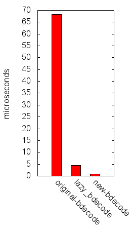
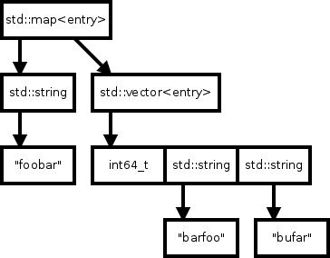
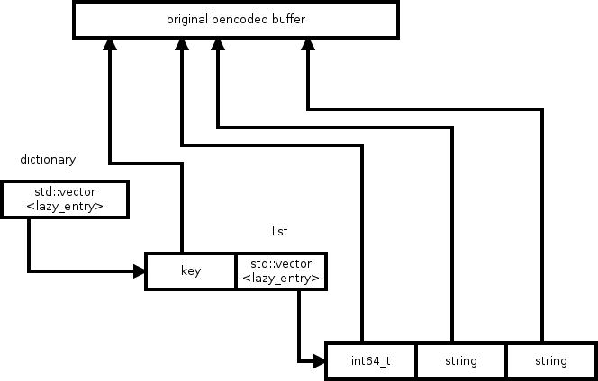
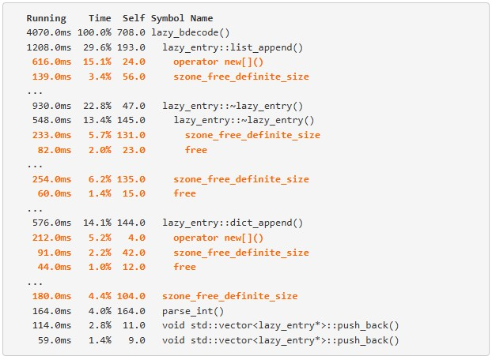
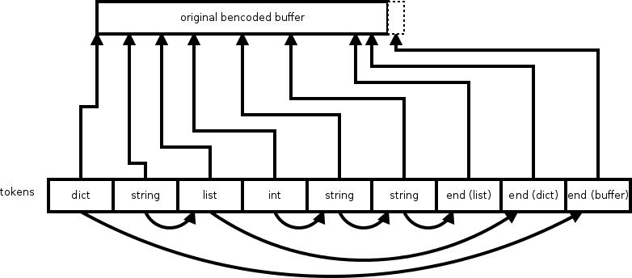

# bencode parsers

我最近重新审视了 libtorrent 中的 bdecoder ，并最终实现了一个新的 bdecoder ，其速度比原始的（朴素的）解析器快了两个数量级。这是 libtorrent 历史上的第三个解码器，我想在此概述一下它解析 bencoded 数据的演变过程。

首先，我编写新 bdecoder 的主要原因是 CPU 和内存的使用情况。 libtorrent 中之前的解码器在这两个指标上的表现都不尽如人意。

让我们先看看基准测试结果:

```
original bdecode()   68218 ns
lazy_bdecode()        4516 ns
new bdecode()          887 ns
```

 


这是使用 libtorrent 中的 3 个不同 bdecoder 解析一个普通 [.torrent](http://cdn.media.ccc.de/congress/2014/h264-sd/31c3-6121-en-de-What_Ever_Happened_to_Nuclear_Weapons_sd.mp4.torrent) 文件所需的时间。新解码器的速度比之前最快的解码器还要快 5 倍。然而，之前最快的解码器已经比原始解码器快了一个数量级。为了理解这些性能特征以及影响它们性能的因素，让我们深入了解一下它们的实现。

# original bdecoder

原始的 bdecoder 将所有解码后的数据复制到一个表示 bencoded 消息结构的树中。其核心是一个可变类型（ libtorrent::entry ），它可以包含 std::map 、 std::vector 、 std::string 和 int64_t 中的任何一种。当解析器遇到一个字典时，它会实例化一个 std::map 并开始用解析出的数据填充它。这意味着在构建过程中，向量会增长，可能会在树增长时复制部分树。图1展示了这一数据结构。



*Figure 1: The data structure of the original bdecoder*

这是 bencoded 结构的内存结构：

```json
{ "foobar": [42, "barfoo", "bufar"] }
```

如您所见，这给内存分配器带来了很大的压力，同时也导致了大量的内存复制。由于存在许多小的内存分配，它还产生了大量的内存开销。仅仅是将字符添加到字符串中，就占据了解析这个测试 torrent 文件时间的 40%。以下是 CPU 性能分析的一个摘录：

|Running    |Time    |Self     |Symbol Name                           |
|-----------|--------|---------|--------------------------------------|
| 46828.0ms | 100.0% | 9.0     | entry bdecode<char*>()               |
| 34946.0ms | 74.6%  | 77.0    | void bdecode_recursive<char*>()      |
| 33022.0ms | 70.5%  | 762.0   | void bdecode_recursive<char*>()      |
| 26699.0ms | 57.0%  | 3431.0  | void bdecode_recursive<char*>()      |
| 19053.0ms | 40.6%  | 11702.0 | std::basic_string<char>::push_back() |

为了解决这些问题，我实现了 lazy_bdecode（以及对应的 lazy_entry ）。

# lazy_bdecode

lazy decoder 的核心理念是完全不复制任何内容。通过构建一个仅指向原始缓冲区的结构，实际的有效负载 ( payload ) 从未被复制或移动。除了有效负载外，该结构与其他结构相当相似。列表仍然是一个指向原始缓冲区的包含 item 的 vector ，字典也是一个键值对的 vector ，只是其数据指向原始缓冲区。

这种方法不仅在构建数据结构时节省了大量内存复制，而且整体使用的内存也显著减少。原始解码器使用的内存至少是此方法的两倍，因为解码缓冲区中的几乎所有内容，都必须复制到一个更小的分配空间中。较低的内存压力加上对字典更连续的内存访问，提供了显著的性能提升。图2展示了 lazy_entry 的数据结构。



*Figure 2: lazy_entry data structure*

lazy_bdecode() 的 CPU 热点看起来是这样的：



尽管在构建结构体时移动的内存量很小，但随着 vectors 的增长，内存的分配和释放仍然会产生显著影响。内存操作的次数并没有真正改变，只是被操作的内存的大小发生了变化。上面分析图中橙色高亮显示的线条都是花费在内存分配或释放上的时间。

# new bdecode

新的 bdecode 的设计灵感来源于 [jsmn](http://zserge.com/jsmn.html) ，一个简洁的 JSON 解析器。从某种程度上讲， jsmn 只能算作半个解析器，因为它仅仅是将 JSON 对象分解成预先分配的 C 语言 token （标识符）数组，而理解和解释这些 token 的任务则留给了用户（这是一项非同小可的任务，因此构成了问题的另一半）。

相比之下，`new bdecoder` 能够将整个结构解析为一个单一的扁平缓冲区。缓冲区中的每一个 item 都是一个 token ，且每个 token 都含有一个“指针”，该“指针”指回原始的 bdecoded 缓冲区，以标明其来源。这在将值映射回原始缓冲区时（例如，在计算info-hash时）是必不可少的。

请注意，此处的“指针”是加引号的，因为在实际应用中，一个真正的指针通常占用8个字节，而在这里我们并不需要完整的指针。相反，**这些“指针”仅仅表示原始缓冲区中的字节偏移量**。除了这个偏移量，还存储了 token 的类型以及指向 token vector 中 `next item` 的“指针”。这里的 `next item` 并不一定是 token stream 中的(物理上)相邻下一个 item，而是取决于具体的结构。有时，为了找到 `next item` ，可能需要跳过整个子树的 token 。`next item` 通过无符号的相对偏移量来表示，即需要跳过的 token 数量。你只需要向前跳过即可。

这种设计使得每个 token 都非常小巧，仅占 8 个字节。与之相比， lazy_entry 中的节点则需要两个指针（一个指向原始缓冲区，另一个指向其自身的子节点数组）、bencoded 缓冲区中的区域大小、类型、子节点的分配大小以及分配容量等信息，总计每个节点需要32个字节。而在 `new bdecoder` 的 token 结构中，仅需包含以下信息即可：

```cpp
// 属性成员一共用了 64 位
struct bdecode_token
{
  enum type_t { none, dict, list, string, integer, end };

  uint32_t offset:29;
  uint32_t type:3; 
  uint32_t next_item:29;
  uint8_t header:3;
};
```

内部结构如图3所示：



*Figure 3: The data structure of the new bdecoder*

每个节点都有一个指向原始缓冲区的偏移量，以及一个指向序列中 `next_item` 的相对指针。

将节点存储在一个单一的扁平 vector 中可以提高**内存的局部性 ( Memory locality )**。使用非常小的 token 结构可以减轻内存的缓存压力。内存操作微乎其微（甚至在分析文件中都未显示）。也就是说，所有时间都用在了实际的解码上，而不是内存分配/释放上。这种方法的一个显著性能优势是，在解析多个文件或消息时，可以重用 `the vector of tokens` ，从而节省了中间的内存释放和分配时间。我已经将bdecode函数作为单独的项目发布在了GitHub上，你可以在这里找到它。

> 译者注：Memory locality（内存局部性）
> --
> 是指在程序执行过程中，数据和指令的访问往往具有一定的空间或时间上的局部集中性。这种局部性原理是计算机系统设计和优化中的一个重要概念，通过充分利用它，可以有效提高计算机系统的性能和效率。
> 
> 内存局部性主要分为以下几种类型：
> 
> - 时间局部性（Temporal locality）‌：
>   如果某个信息这次被访问，那它有可能在不久的未来被多次访问。这种情况下，可以把常用的数据加cache来优化访存。
> 简单来说，如果某个数据项被访问过，那么它在不久的将来很有可能再次被访问。
> ‌
> - 空间局部性（Spatial locality）‌：
>   如果某个位置的信息被访问，那和它相邻的信息也很有可能被访问到。这通常是因为大部分情况下代码都是顺序执行，数据也是顺序访问的。
> 访问内存时，大概率会访问连续的块，而不是单一的内存地址，这其实就是空间局部性在内存上的体现。
> ‌
> - 分支局部性（Branch locality）‌：
>   又被称为顺序局部性，计算机中大部分指令是顺序执行，即便有if这种选择分支，其实大多数情况下某个分支都是被大概率选中的，于是就有了CPU的分> 支预测优化。 

我已经把 bdecode 功能作为一个单独的项目放在 github 上了， 你可以在 [这里](https://github.com/arvidn/bdecode) 找到它。